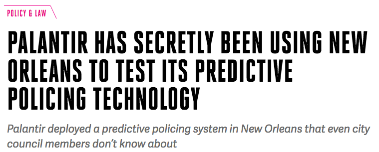
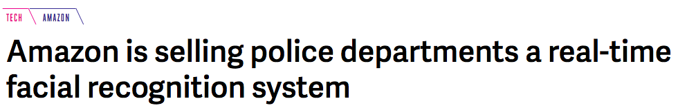
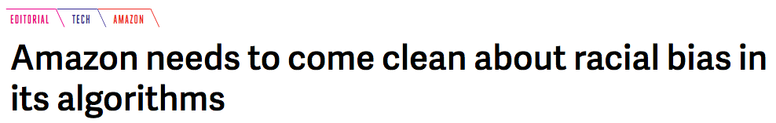
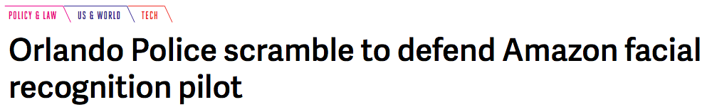
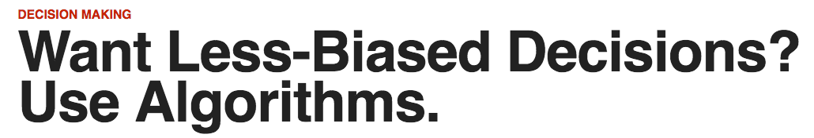
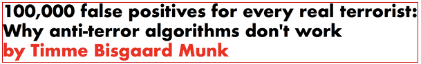
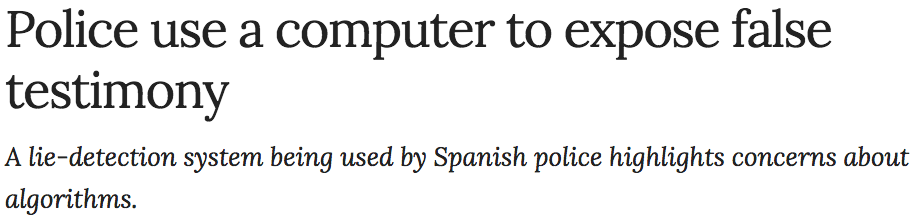
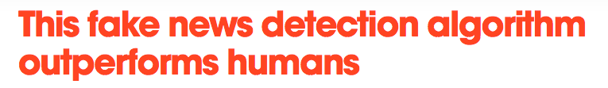

## Welcome {data-background="./img/ucl_artwork/ucl-banner-land-darkblue-rgb.png" data-background-size="70%" data-background-position="top" data-background-opacity="1"}

Advanced Crime Analysis

Computational Crime Science

Data Science for Crime Science

### What is this?


## Why not just "[fancy adjective] Crime Analysis"?

byte KB MB GB TB ZB ...

Per second ... per day


## Crime Science in the 21st century

New research questions!

New ways to solve problems!

Also: uncomfortable!!


## Aaah: so we're talking Big Data!


## Problems with "Big Data"

- what is "big"?
- data = data?
- complexity of data?
- sexiness of small data

## Game-changers in Crime Science

1. existence of data
2. availability of data
3. availability of computing resources
4. obsession with prediction

## The time is now



--> Lecture 7 + 8

<small>[https://www.theverge.com/2018/2/27/17054740/palantir-predictive-policing-tool-new-orleans-nopd](https://www.theverge.com/2018/2/27/17054740/palantir-predictive-policing-tool-new-orleans-nopd)</small>

## The time is now


<small>[https://www.theverge.com/2018/5/22/17379968/amazon-rekognition-facial-recognition-surveillance-aclu](https://www.theverge.com/2018/5/22/17379968/amazon-rekognition-facial-recognition-surveillance-aclu)</small>


<small>[https://www.theverge.com/2018/5/23/17384632/amazon-rekognition-facial-recognition-racial-bias-audit-data](https://www.theverge.com/2018/5/23/17384632/amazon-rekognition-facial-recognition-racial-bias-audit-data)</small>


## The time is now



<small>[https://www.theverge.com/2018/5/24/17391632/amazon-facial-recognition-orlando-police-rekognition](https://www.theverge.com/2018/5/24/17391632/amazon-facial-recognition-orlando-police-rekognition)</small>

--> Lecture 9

## The time is now



<small>[https://hbr.org/2018/07/want-less-biased-decisions-use-algorithms](https://hbr.org/2018/07/want-less-biased-decisions-use-algorithms)</small>

--> Lecture 9

## The time is now



<small>[http://firstmonday.org/ojs/index.php/fm/article/view/7126/6522](http://firstmonday.org/ojs/index.php/fm/article/view/7126/6522)</small>

--> Lecture 7, 8, 9

## The time is now


<small>[https://www.nature.com/articles/d41586-018-05285-9](https://www.nature.com/articles/d41586-018-05285-9)</small>

--> Lecture 4 + 5

## The time is now


<small>[https://thenextweb.com/artificial-intelligence/2018/08/22/this-fake-news-detection-algorithm-outperforms-humans/](https://thenextweb.com/artificial-intelligence/2018/08/22/this-fake-news-detection-algorithm-outperforms-humans/)</small>

--> Lecture 4 + 5

## What is going on there?


## Current situation

Data Science Wild West

- Anything goes
- A lot of great things
- A lot of sh**

You'll learn to tell hype from promise!


## Becoming a real problem-solver

Principle 1: There's no magic in Data Science

Principle 2: Golden data never comes in a spreadsheet

Principle 3: Data treasures are hidden in front of you

## **Principle 1:**

### There's no magic in Data Science


## **Principle 1:** 

### There's no magic in Data Science

All names of current FBI most wanted terrorists?

Let's start here: [https://www.fbi.gov/wanted/terrorism](https://www.fbi.gov/wanted/terrorism)

## Using data science techniques...

```{r echo=FALSE}
library(rvest)
target_page = read_html('https://www.fbi.gov/wanted/terrorism')
target_page %>%
  html_nodes('p.name') %>%
  html_text()
```

## The magic? A few lines of code

```{r}
library(rvest)
target_page = read_html('https://www.fbi.gov/wanted/terrorism')
target_page %>%
  html_nodes('p.name') %>%
  html_text()
```


## **Principle 2:**

### Golden data never come in a spreadsheet

## Golden data never come in a spreadsheet

```
1
00:00:00,000 --> 00:00:01,829
although there's no hard evidence<font color="#E5E5E5"> to</font>

2
00:00:01,829 --> 00:00:03,419
support Warren's claim of Native

3
00:00:03,419 --> 00:00:06,060
American<font color="#E5E5E5"> ancestry she has cited family</font>

4
00:00:06,060 --> 00:00:09,990
<font color="#E5E5E5">lore and not just a stray remarks about</font>

5
00:00:09,990 --> 00:00:12,750
her cheekbones<font color="#E5E5E5"> like that could be in the</font>

6
00:00:12,750 --> 00:00:14,190
<font color="#CCCCCC">onion</font><font color="#E5E5E5"> that literally could be in the</font>

7
00:00:14,190 --> 00:00:18,390
onion<font color="#E5E5E5"> all right</font><font color="#CCCCCC"> this is a special</font>
```

## **Principle 3:**

### Data treasures are hidden in front of you

## Data treasures are hidden in front of you


## Yeah, really cool.

But: I don't need this "programming" for this!


## "Programming" is only the vehicle.

**Matter of volume**

## 10 min. break


## This module


## Aim

- introduction to data science techniques
- being able to use state-of-the-art tools for crime analysis
- learning how to solve difficult problems
- "your quantitative masterpiece"

More on learning outcomes in the [module handbook](https://rawcdn.githack.com/ben-aaron188/ucl_aca_20182019/6d620d3f3357e3956b91ae232992d731ded6925c/aca_SECU0050_module_outline.html)


## Things you'll learn

- Access Twitter data
- Build a web-scraper to the FBI's most wanted terrorists
- Write code that crawls through details of all missing persons in the UK
- Analyse the language of toxic YouTubers
- Build a linguistic model of Tweets in London
- Build your own machine learning models to predict whether a news article is fake or not

+ your own capstone project

## Tools we'll use


- open-source + free
- wide support community (e.g., on [Stackoverflow](https://stackoverflow.com/questions/tagged/r))
- made for statistics
- state-of-the-art libraries

## But still...


- R [grows fast](https://stackoverflow.blog/2017/10/10/impressive-growth-r/)
- Highly desirable/required in industry (Google, Facebook, Microsoft, Amazon, ...)

## Structure of the module

- 9 Lectures (Mondays, 13-15h)
- 5 Tutorials (alternating Tuesdays, 11-13h)

Teaching assistant: Felix Soldner

## Assessment

- Class test
- Applied Data Science Project

## Class test

- 30% of final grade
- 1-hour closed-book exam
- open questions & MC questions
- Date: 18 Mar 2019, 13-15h

## Applied Crime Analysis Project

- 70% of final grade
- your capstone project
- apply all skills learned in this module
- solve a problem you like
- we're here to help: peer feedback + 1-on-1 feedback sessions

## Feedback sessions

- Peer-feedback
    - shared evaluation among all students
    - at end of the “Text data II” lecture on 4 Feb. 2019
- 1-on-1 feedback
    - 10 min individual feedback from me and Felix
    - final advice to fine-tune your project
    - 4 March 2019

## Outlook

- Webscraping
- Text mining
- Machine learning


## What's next?

Homework for today: 

1. [Getting ready for R (on Moodle)](https://raw.githack.com/ben-aaron188/ucl_aca_20182019/master/homework/getting_ready_for_r.html)
2. [R for Crime Scientists in 12 Steps](https://raw.githack.com/ben-aaron188/ucl_aca_20182019/master/homework/r_in_12_steps.html)

Tomorrow's tutorial: "WTF!? session"

Next week: Web scraping

