##  {data-background="./img/ucl_artwork/ucl-banner-land-darkblue-rgb.png" data-background-size="70%" data-background-position="top" data-background-opacity="1"}

Getting data from the Internet

Webscraping 1

## Today

- Types of webscraping
- Using APIs: Twitter + YouTube
- Crime data 'wrappers'
- "Real" webscraping: basics of a webpage

## What is webscraping anyway?

## The game changer!

- direct broadcasting of ideas
- "unfiltered" and "uncensored" (?)
- location-enabled
- and: _en masse_

##

##


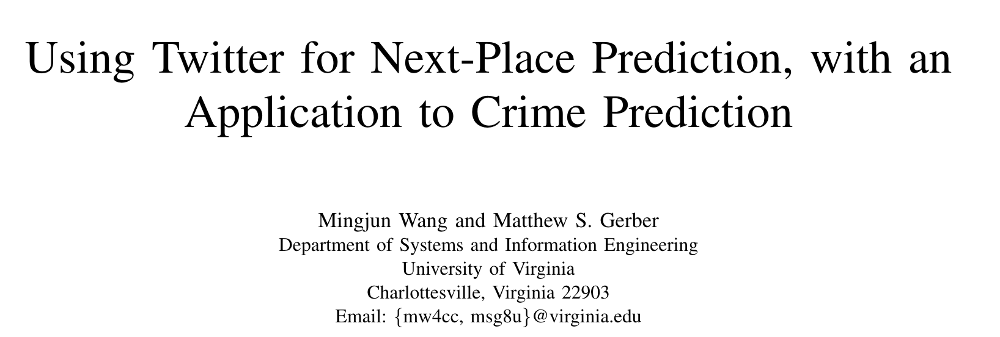

##

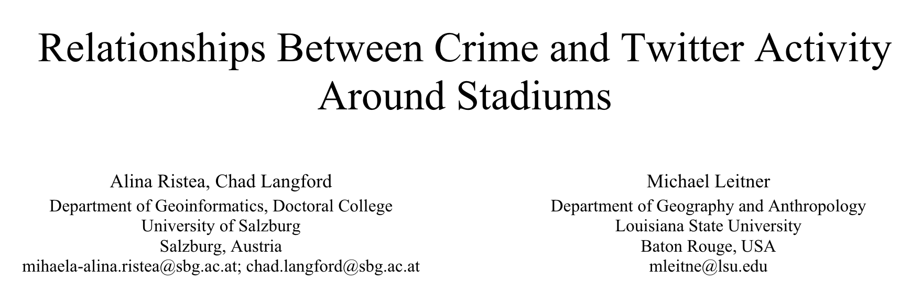

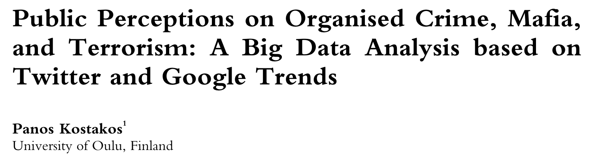

##

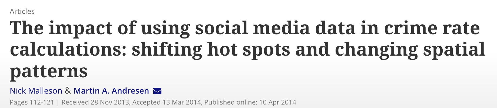


## Types of webscraping

|   | Data shared | Data not shared |
|------------------|-------------|-----------------|
| Ready-made table | Download | _closed source_ |
| Not ready-made | API | Real webscraping |

## 

### Application programming interfaces (APIs)

## API: basics

Goal:

- help developers interact with the platform
- facilitates interaction in an automatable manner
- analogous to the GUI
- part of it: enabling data access
- contains precise documentation

## What an API does not do:

- give you all the data
- be free forever
- give you full control

There' no free lunch!

## Using an API

Core elements of an API:

- GET requests
- POST requests

Implementable in different ways...

## Using an API

Classes of APIs:

1. Web APIs
    - send requests through the browser
    - add URL parameters
    `https://data.police.uk/api/crimes-at-location?date=2017-08&location_id=884227`
2. Libraries/packages for APIs
    - depending on the API: python, js, php, ruby
    - = frameworks to access the API
    - = methods implemented in different languages
3. API wrappers
    - R packages that use the API

## Using an API

Identify API capabilities

[Official API docs Twitter](https://developer.twitter.com/en/docs/tweets/search/api-reference)

## Useful websites that have an API

- Twitter
- YouTube
- Instagram
- Facebook
- Reddit

## Case 1: Twitter's API


## Getting access

Basic steps

1. Twitter account
2. Apply for a developer's account
3. Create project
4. Obtain access credentials

Tutorial [here](https://towardsdatascience.com/access-data-from-twitter-api-using-r-and-or-python-b8ac342d3efe)

## The `rtweet` package

```{r}
library(twitteR)
```

- Documentation: [R Docs](https://www.rdocumentation.org/packages/twitteR/versions/1.1.9)
- Demos: [basic first steps]https://towardsdatascience.com/access-data-from-twitter-api-using-r-and-or-python-b8ac342d3efe) + next week's tutorial

Note: check out the newer [rtweet](https://github.com/mkearney/rtweet) package.

## Authenitication through R


```{r}
my_consumer_key = "5tc2oAVLyO8DkCKW1k8ny2H6e"
my_consumer_secret = "qEQYGX6IKs6NiSUsENprBZlOOdoM9lWkoIht3p1sVnAMraQpq2"
my_access_token = "858383409986625537-Fy9Ai5eFyf23VZHguRJEdXqell6Q8Jl"
my_access_secret = "nT5Z0eQjAvBdf2ZjxMgiaoRb7hiHVxB8jYh7lT74CW1Um"

setup_twitter_oauth(consumer_key = my_consumer_key
                    , consumer_secret = my_consumer_secret
                    , access_token = my_access_token
                    , access_secret = my_access_secret
                    )
```


## How to search?

**Remember the problem-solving approach?**

Start with the problem...

...then do what's necessary to solve it.

_The research question determines the method_


## How to search?

Depends on the problem:

- Tweets in a certain time frame (e.g. December 2018)
- Tweets with a certain key-word (e.g. "#metoo")
- Tweets by a certain author (e.g. Elon Musk)
- Tweets in a certain location (e.g. London)
- Tweets in a certain language
- Combined search queries


## API possibilities

Always look at two sources:

1. The original API [(Twitter's API docs)](https://developer.twitter.com/en/docs/tweets/search/api-reference/get-search-tweets.html)
2. The API interface [(`twitteR R package`)](https://www.rdocumentation.org/packages/twitteR/versions/1.1.9)

Note: mostly original API options > API interface options.


## Tweets by date

Search:

- tweets since December 2018
- with `#metoo`

```{r}
metoo_tweets_december = searchTwitter(searchString = '#metoo'
                                , n = 10
                                , since = '2018-12-01'
                                )
metoo_tweets_december
```

## Tweets by date

Display as dataframe with meta information:

```{r}
twListToDF(metoo_tweets_december)
```

## Tweets by date

**Example:** Popular crime tweet in 2019?
```{r}
crime_tweets_2019 = searchTwitter(searchString = 'crime'
                                , n = 1000
                                , since = '2019-01-01'
                                , resultType = 'popular'
                                )

df.crime_tweets_2019 = twListToDF(crime_tweets_2019)

df.crime_tweets_2019[order(df.crime_tweets_2019$created, decreasing = F), ][1:3, 'text']
```

## Tweets by keyword

Search:

- "fake news" tweets
- since the start of the year


```{r}
fakenews_tweets_2019 = searchTwitter(searchString = 'fake+news'
                                , n = 1000
                                , since = '2019-01-01'
                                , resultType = 'popular'
                                )
```

##

```{r}
df.fakenews_tweets_2019 = twListToDF(fakenews_tweets_2019)
df.fakenews_tweets_2019[order(df.fakenews_tweets_2019$retweetCount, decreasing = T), ][1:5, ]
```


## Tweets by keyword

Search:

- knife crime
- yesterday

```{r}
knife_crime_yesterday = searchTwitter(searchString = 'knife+crime'
                                , since = '2019-01-08'
                                )
```

##

```{r}
knife_crime_yesterday[1:10]
```


## Tweets by combined keywords

**Example:** Tweets about knife killings in London in 2019

```{r}
knife_killings_london = searchTwitter(searchString = 'knife+killing+london'
                                , since = '2019-01-01'
                                )
knife_killings_london[1:5]
```


## Tweets by combined keywords

Zoom in further...

**Example:** Tweets about [murder on Surrey train](https://www.theguardian.com/uk-news/2019/jan/06/surrey-train-lee-pomeroy-stabbing-police-get-12-more-hours-to-question-suspect) (4th of Jan)

```{r}
surrey_train_killings = searchTwitter(searchString = 'surrey+murder+knife'
                                , since = '2019-01-01'
                                , n = 100
                                )

df.surrey_train_killings = twListToDF(surrey_train_killings)

#how many are retweets?
table(df.surrey_train_killings$isRetweet)
```

## Tweets by author

Search:

- tweets in 2019 
- by the Mayor of London

```{r}
mol_2019 = searchTwitter(searchString = 'from:MayorofLondon'
                         , since = '2019-01-01'
                         , n = 100
                         )
```

##

```{r}
df.mol_2019 = twListToDF(mol_2019)
head(df.mol_2019)
```


## Tweets by author

```{r}
plot(df.mol_2019$retweetCount, df.mol_2019$favoriteCount)
```

## The "outlier"?

```{r}
df.mol_2019[which.max(df.mol_2019$favoriteCount), 'text']
```

## Tweets by location

Search:

- most retweeted tweets --> **sort by `retweetCount`**
- yesterday --> **set date to 8 Jan 2019**
- in London --> **???**
- about: ... 

Solution: geo coordinates.

## Tweets by location


**(51.507824, -0.127654)**

We also add a radius around that point location.

## Tweets by location

```{r}
tweets_in_london = searchTwitter(searchString = ' '
                         , since = '2019-01-01'
                         , n = 100
                         , geocode='51.507824,-0.127654,15km'
                         )
head(tweets_in_london)
```

## Tweets by language

Common problem:

- you search for a keyword
- but it's in multiple languages

```{r}
?searchTwitter
```

`lang`:

  > If not NULL, restricts tweets to the given language, given by an ISO 639-1 code

## Tweets by language

ISO 639-1 language codes: [https://www.loc.gov/standards/iso639-2/php/code_list.php](https://www.loc.gov/standards/iso639-2/php/code_list.php)

```{r}
searchTwitter(searchString = '#metoo'
                         , since = '2019-01-01'
                         , n = 5
                         , lang = 'en'
                         )
```

## Tweets by language

```{r}
searchTwitter(searchString = '#metoo'
                         , since = '2019-01-01'
                         , n = 5
                         , lang = 'es'
                         )
```

## Combined search queries

**Example:**  Burglaries since Christmas?

```{r}
combined_query_1 = searchTwitter(searchString = 'burgled'
              , since = '2018-12-24'
              #, until = '2019-01-07'
              , n = 100
              , lang = 'en'
              )
head(combined_query_1)
```


## Combined search queries

**Example:** Reactions to the Soubry issue in two cities?

```{r}
soubry_london = searchTwitter(searchString = 'soubry'
              , since = '2019-01-01'
              , n = 100
              , lang = 'en'
              , geocode='51.507824,-0.127654,15km'
              )
head(soubry_london, 2)
```

```{r}
soubry_manchester = searchTwitter(searchString = 'soubry'
              , since = '2019-01-01'
              , n = 100
              , lang = 'en'
              , geocode='53.480874,-2.242588,15km'
              )
head(soubry_manchester, 2)
```

## Combined search queries

_Your turn: what does this search do?_

```{r results='hide'}
searchTwitter(searchString = '@Anna_Soubry + nazi'
              , since = '2019-01-01'
              , n = 5
              , lang = 'en'
              , resultType = 'popular'
              )
```


## Combined search queries

_Your turn: what does this search do?_

```{r}
searchTwitter(searchString = '@Anna_Soubry + nazi'
              , since = '2019-01-01'
              , n = 5
              , lang = 'en'
              , resultType = 'popular'
              )
```

## Get Twitter trends

```{r}
?getTrends
```

`getTrends(woeid, exclude=NULL, ...)`

  > woeid: A numerical identification code describing a location, a Yahoo! Where On Earth ID

--> Cross-reference WOEID against search string/address [here](http://woeid.rosselliot.co.nz/lookup/san%20francisco)

## getTrends...

San Francisco, California --> `woied = 2487956`

```{r}
trends_sf = getTrends(woeid = 2487956)

head(trends_sf)
```

## Additional stuff...

**Twitter API/twitteR package**

- URLs
- followers
- user info
- ...

**Twitter Search API vs Twitter Stream API**

- query quality
- result quantity

##

### Problems with Twitter/YouTube data?

## Some issues:

- Sample representativeness
- Location accuracy
- Location availability
- Sampling through API

## Case 2: Youtube's API


## Getting access

Basic steps

1. Google account
2. Login to Google Developers Console
3. Create project/app
4. Obtain access credentials

Tutorial [here](https://help.aolonnetwork.com/hc/en-us/articles/218079623-How-to-Create-Your-YouTube-API-Credentials)

## The `tuber` package

```{r}
library(tuber)
```

- Documentation: [pdf](https://cran.r-project.org/web/packages/tuber/tuber.pdf)
- Source code: [GitHub](https://github.com/soodoku/tuber)
- Demos: [developer's tutorial](http://soodoku.github.io/tuber/), [basic first steps](https://towardsdatascience.com/what-is-api-and-how-to-use-youtube-api-65525744f520) + next week's tutorial

## Authentication

```{r}
client_secret = 'rwHJJDPf_xdvIWmQ4TL00HKz'
client_id = '625618111946-mf44nomvi5m9ot668b59k7koq122jmaa.apps.googleusercontent.com'

yt_oauth(app_id = client_id, app_secret = client_secret, token='')

```

## Meta data per video

First step: get the video ID.

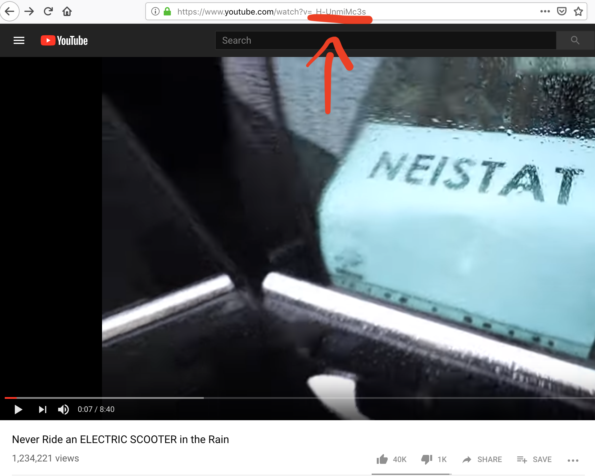

## Meta data per video

Get the "meta" stats for this video:

```{r}
video_identifier = '_H-UnmiMc3s'

video_stats = get_stats(video_id = video_identifier)
as.data.frame(video_stats)
```

## Detailed data per video

Want more depth of detail?

```{r}
video_details = get_video_details(video_id = video_identifier)
video_details
```


## Detailed data per video

A closer look:

`items[[1]]$snippet$thumbnails$high$url`

[https://i.ytimg.com/vi/_H-UnmiMc3s/hqdefault.jpg](https://i.ytimg.com/vi/_H-UnmiMc3s/hqdefault.jpg)


Think of:

- thumbnails for propaganda
- clickbait understanding

## Comments per video

Comments made below the video:

New video: [Introducing the Numberphile Podcast](https://www.youtube.com/watch?v=0GzhWPj4-cw)

```{r}
video_identifier_2 = '0GzhWPj4-cw'

video_comments = get_all_comments(video_id = video_identifier_2)
names(video_comments)
```


## Comments per video

A closer look:

```{r}
head(video_comments)
```

## Transcript (captions)

YouTube transcrips yet untapped source!

Few exceptions:

- [Identifying the sentiment styles of YouTube’s vloggers](https://arxiv.org/ftp/arxiv/papers/1808/1808.09722.pdf)
- [Social Media Sellout: The Increasing Role of Product Promotion on YouTube](https://journals.sagepub.com/doi/10.1177/2056305118786720)

## Transcript (captions)

Tricky to get transcripts.

- uploader needs to provide proper transcript (high quality, low availibility)
- workaround approach (moderate/low quality, high availibility)

```{r}
?get_captions
?list_caption_tracks
```


<!-- ## Transcript (captions) -->

<!-- 1. Get caption track ID -->
<!-- 2. Retrieve captions by caption track ID. -->

<!-- ```{r} -->
<!-- caption_track_data = list_caption_tracks(video_id = video_identifier_2) -->
<!-- caption_track_data -->
<!-- ``` -->

<!-- ## Transcript (captions) -->

<!-- ```{r} -->
<!-- caption_id = caption_track_data$id -->
<!-- caption_id -->

<!-- captions = get_captions(id = caption_id) -->
<!-- ``` -->

## Meta data per channel

First: identify the channel ID.

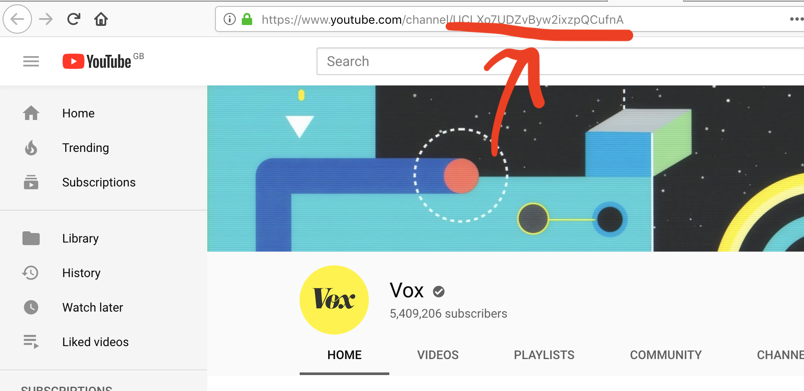

## Meta data per channel

```{r}
channel_identifier = 'UCLXo7UDZvByw2ixzpQCufnA'
channel_stats = get_channel_stats(channel_id = channel_identifier)
```

##

```{r}
channel_stats
```


## Meta data per channel

Some statistics per channel:

```{r}
channel_stats$statistics
```

## Activity data per channel

New channel (smaller): [JSNation](UCQM428Hwrvxla8DCgjGONSQ)

```{r}
channel_identifier_2 = 'UCQM428Hwrvxla8DCgjGONSQ'
channel_activity = list_channel_activities(filter = c(channel_id = channel_identifier_2),
                                           max_results = 50)
names(channel_activity)
```

## Activity data per channel

```{r}
head(channel_activity)
```

## Video stats per channel

Stats for all videos in a channel:

```{r message=FALSE, warning=FALSE, results='hide'}
all_video_stats = get_all_channel_video_stats(channel_id = channel_identifier_2)
names(all_video_stats)
```

## Video stats per channel

```{r}
head(all_video_stats)
```

## Additional queries

- subscriber info: `get_subscriptions`
- list all videos: `get_`

##

### Problems with Twitter/YouTube data?

## Some issues:

- Sample representativeness
- ~~Location accuracy~~
- ~~Location availability~~
- ~Sampling through API~
- Transcript quality
- Real representations (filtered)
- Censored?

##

## Crime data interfaces

- [police.uk](https://data.police.uk/)
- [R package "crimedata"](https://cran.r-project.org/web/packages/crimedata/crimedata.pdf)


## police.uk as data repository

### Public database of "open police data"

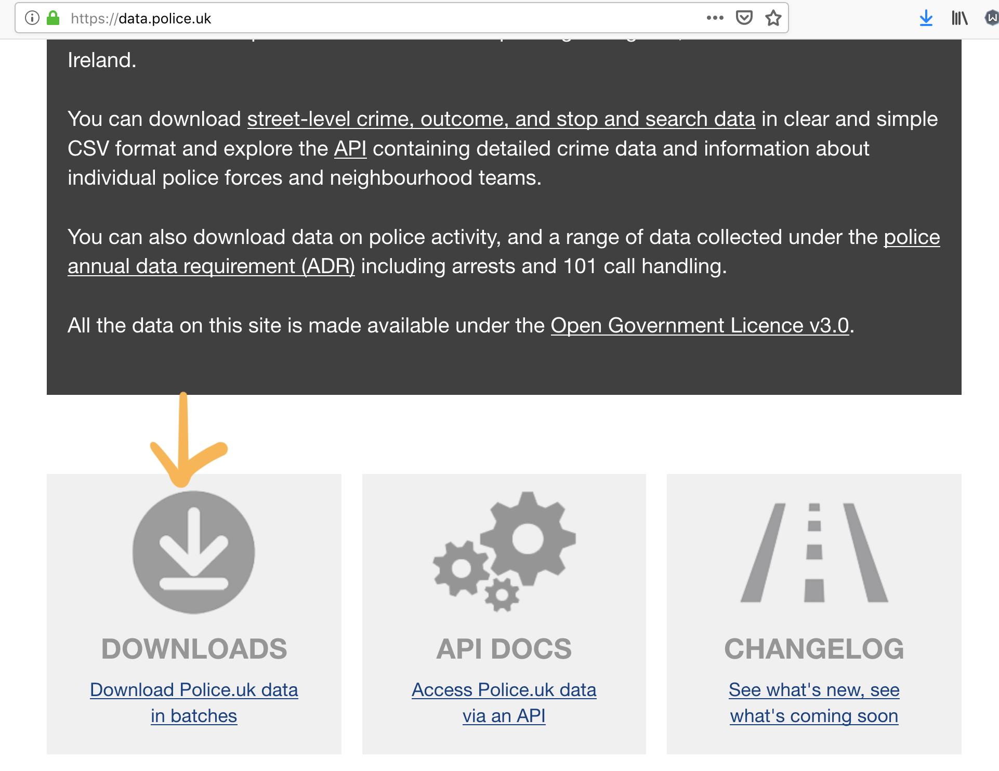

## police.uk as data repository

### API?

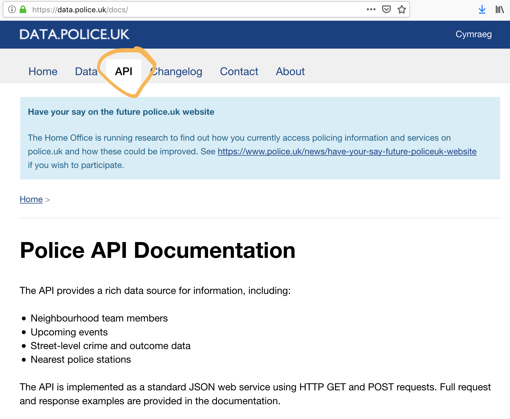

## police.uk as data repository

Using the API:

- different method
- calls direct from the browser
- no R implementation


  > The API is implemented as a standard JSON web service using HTTP GET and POST requests. Full request and response examples are provided in the documentation.
  
## police.uk as data repository

["Crimes at location"](https://data.police.uk/docs/method/crimes-at-location/)

Search query example:

```{html}
https://data.police.uk/api/crimes-at-location?date=2017-08&location_id=884227
```


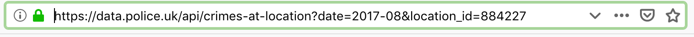

## police.uk as data repository

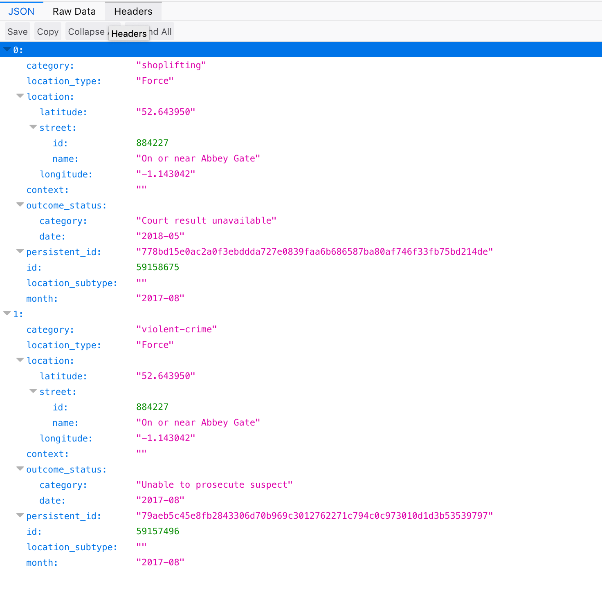

## `crimedata` package

```{r}
library(crimedata)
```


## `crimedata` package

Aim:

  > Gives convenient access to publicly available police-recorded open
crime data from large cities in the United States that are included in the
Crime Open Database

[Open Crime Database](https://osf.io/zyaqn/)

## `crimedata` package

Which data are available?

```{r message=TRUE, warning=TRUE, paged.print=FALSE}
list_crime_data(quiet = FALSE)
```


## `crimedata` package

Getting data:

```{r warning=FALSE}
crime_data_ny_2017 = get_crime_data(years = 2017
                            , cities = c("New York"))
```

##

```{r}
names(crime_data_ny_2017)
head(crime_data_ny_2017)
```


## `crimedata` package

Multiple cities, multiple years:

```{r message=FALSE}
crime_data_2010_2015 = get_crime_data(years = 2010:2015
                            , cities = c("Chicago", "Detroit"))

table(crime_data_2010_2015$city_name, crime_data_2010_2015$offense_against)
```

## `crimedata` package

Additional features:

- `nycvehiclethefts`: Dataset containing records of thefts of motor vehicles in New York City from 2014 to 2017
- `homicides15`: Dataset containing records of homicides in nine large US cities in 2015

##


## APIs: Pros & Cons 

**Pro**

- easiy to access
- nicely documentation
- **works even if website changes**

**Cons**

- quota limits ($ $ $)
- under the platforms' control
- only for few platforms

##

### Don't let the data determine your research!


---

## COOL

But what about:


##


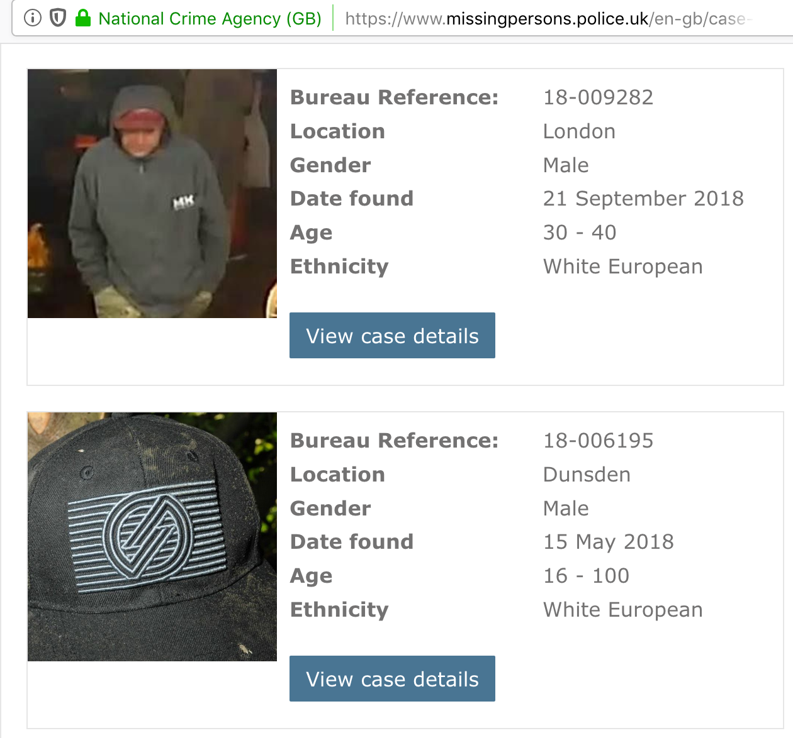

## No APIs

- incels.me
- stormfront
- 4chan

+ **APIs are restrictive!**

## ... what about:

### Your research question --> no API?


##

Main problem:

**Really ‘juicy’ data of the Internet** vs **APIs**


## "Real" webscraping: basics of a webpage

## Three elements of a webpage

1. Structure
2. Behaviour
3. Style

## Three elements of a webpage

1. Structure
2. Behaviour
    - JavaScript (**!= Java**)
    - user interaction
    - examples: alerts, popups, server-interaction
3. Style

## Three elements of a webpage

1. Structure
2. Behaviour
3. Style
    - CSS (Cascading Style Sheets)
    - formatting, design, responsiveness
    - examples: submit buttons, app interaces

## Three elements of a webpage

1. Structure
    - HTML (hypertext markup language)
    - structured with `<tags>`
    - contains the pure content of the webpage
2. Behaviour
3. Style

## For now: HTML

The very basics of HTML:

**Raw architecture of a webpage**

```{html}
<!DOCTYPE html>
<html>
<body>

HERE COMES THE VISIBLE PART!!

</body>
</html>
```


*Note:* Every tags `< >` is closed `< />`. Content is contained within the tag.

## HTML basics

Ways to put content in the `<body> ... </body>` tag:

- headings: `<h1>I'm a heading at level 1</>`

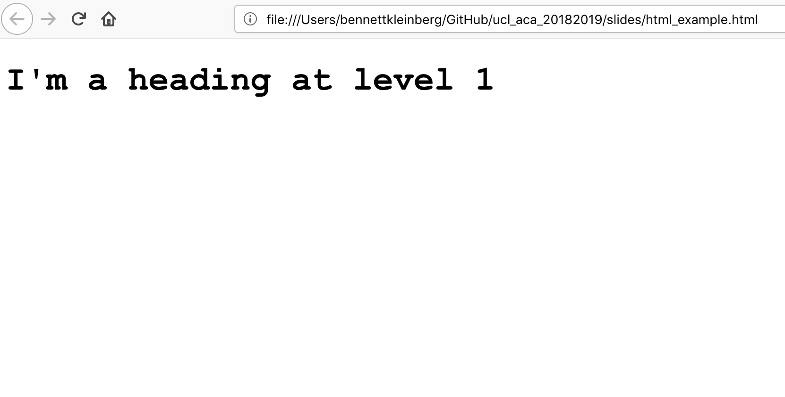


## Content in the body tag

- paragraphs: `<p>This is a paragraph</p>`

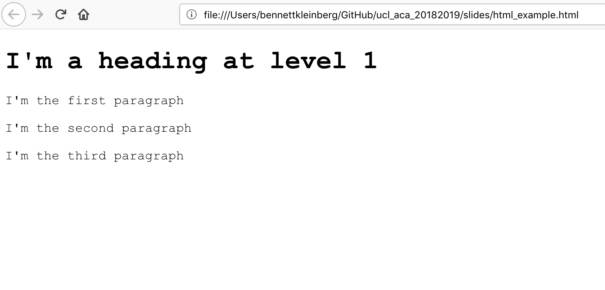

## Content in the body tag

- images: ``


## Content in the body tag

- links: `<a href="https://www.ucl.ac.uk/">Click here to go to UCL's website</a></a> `

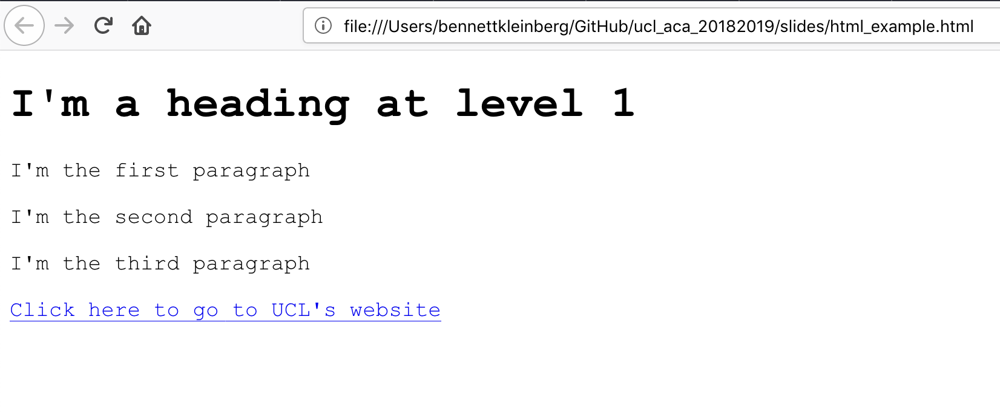

## Content in the body tag

- tables

```{html}
<table>
  <tr>
    <th>Departments</th>
    <th>Location</th>
  </tr>
  <tr>
    <td>Dept. of Security and Crime Science</td>
    <td>Division of Psychology and Language Sciences</td>
  </tr>
  <tr>
    <td>35 Tavistock Square</td>
    <td>26 Bedford Way</td>
  </tr>
</table> 
```

## Html `<table>...</table>`

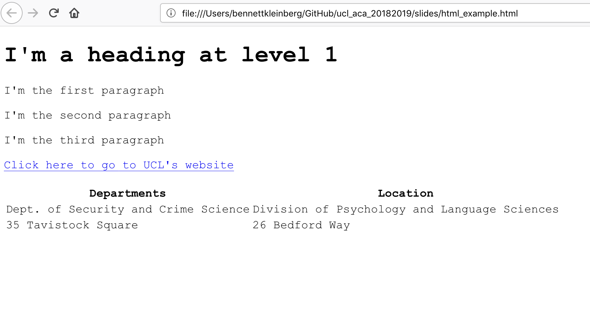

## Content in the body tag

- lists

```{html}
<ul>
  <li>Terrorism</li>
  <li>Cyber Crime</li>
  <li>Data Science</li>
</ul> 
```

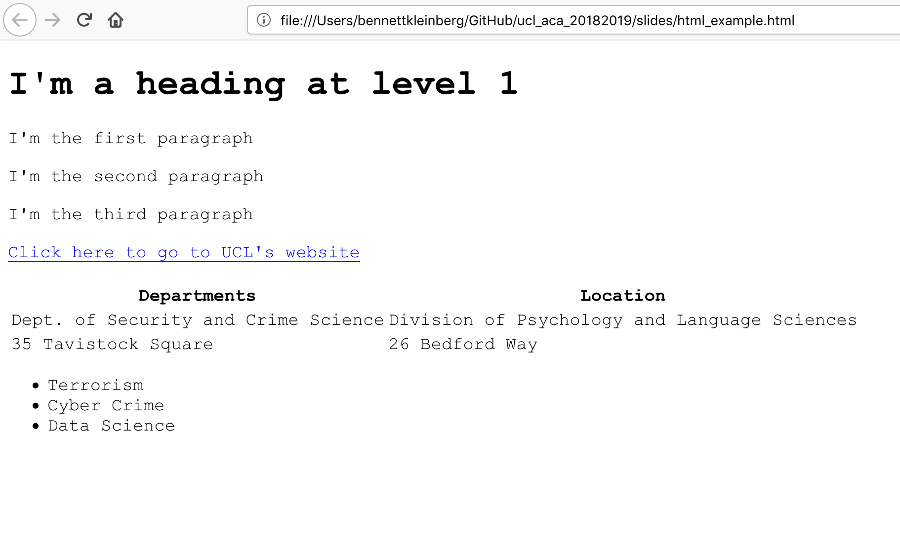

## HTML basics

Elements (can) have IDs:

```{html}
<p id='paragraph1'>This is a paragraph</p>

```


Same for tables, links, etc.

Every element can have an ID.

You need unique IDs! Two elements cannot have the same ID.

## HTML basics

Common elements (can) have CLASSES:

```{html}
<p id="paragraph1" class="paragraph_class">I am the first paragraph</p>
<p class="paragraph_class">I am the second paragraph</p>
<p class="paragraph_class">I am the third paragraph</p>

```


Multiple elements can have the same class.

##

### Now what?

## Web scraping logic

If all webpages are built in this structure...

... then we could access this structure programmatically.

## But where do I find that structure?

Is it just "there"?

**YES!!**

## How to see the html structure?


##

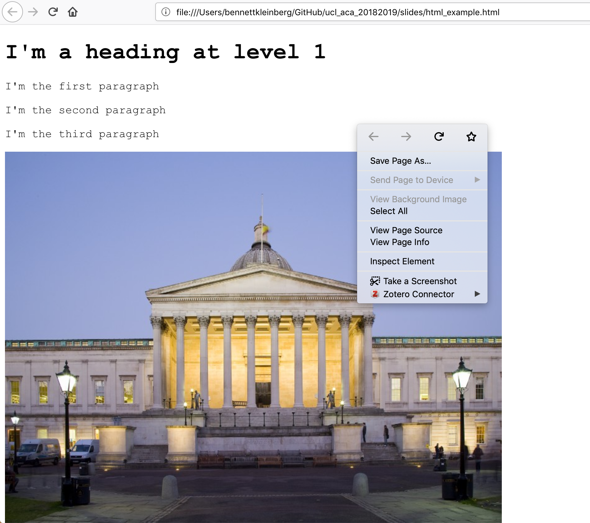

##


##

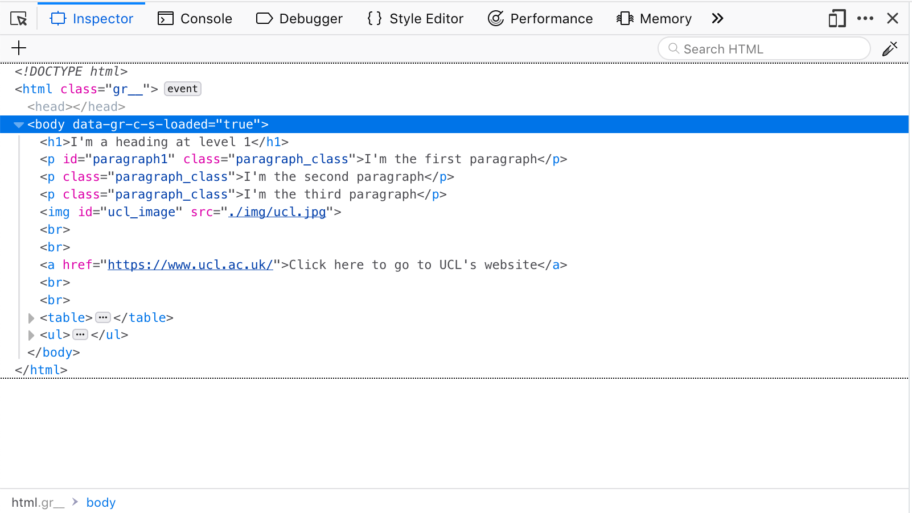

##

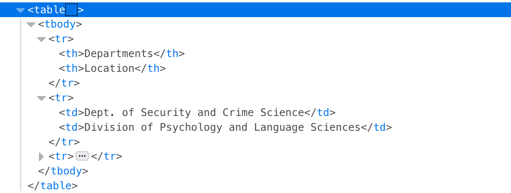

## Example 1: Missing persons

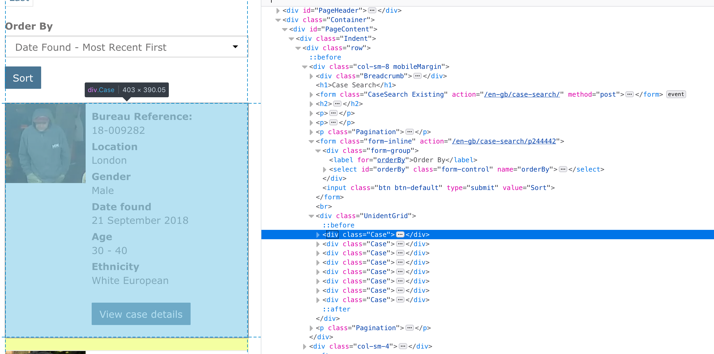

## Example 1: Missing persons

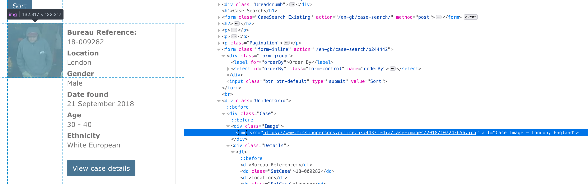

## Example 2: FBI most wanted

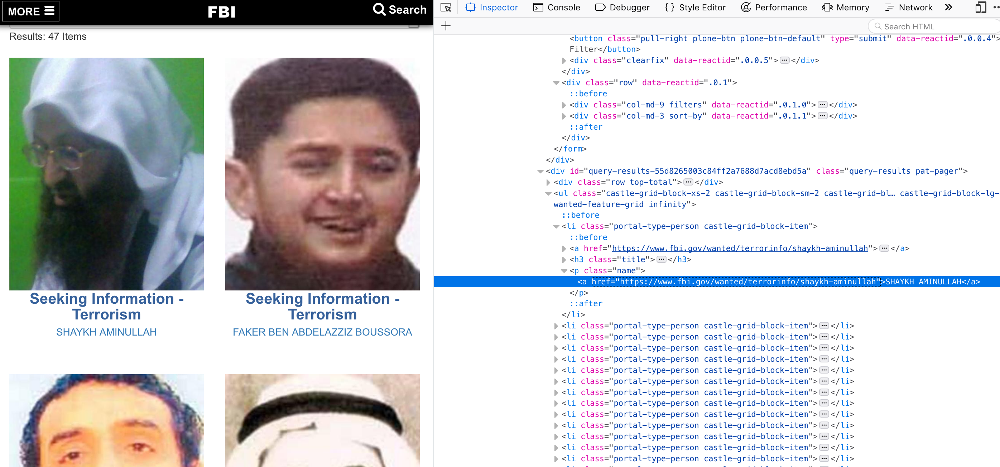

## Webscraping in a nutshell

1. understand the structure of a webpage
2. exploit that structure for web-scraping

##

## RECAP

- **Always: problem first, never the method first!**
- **Method follows problem!**
- APIs give you structured access
- R packages `twitteR` and `tuber`
- HTML structure key to 'real' webscraping

## Outlook

**Next week**

- Webscraping on the html structure
- Tutorial: APIs + webscraping in R

**Homework**

- Getting access to YouTube and Twitter API.

## END
