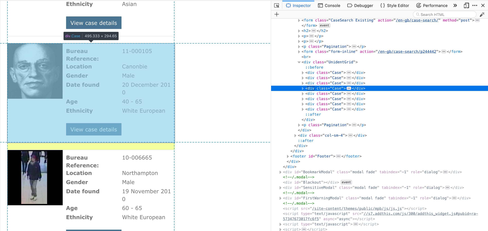
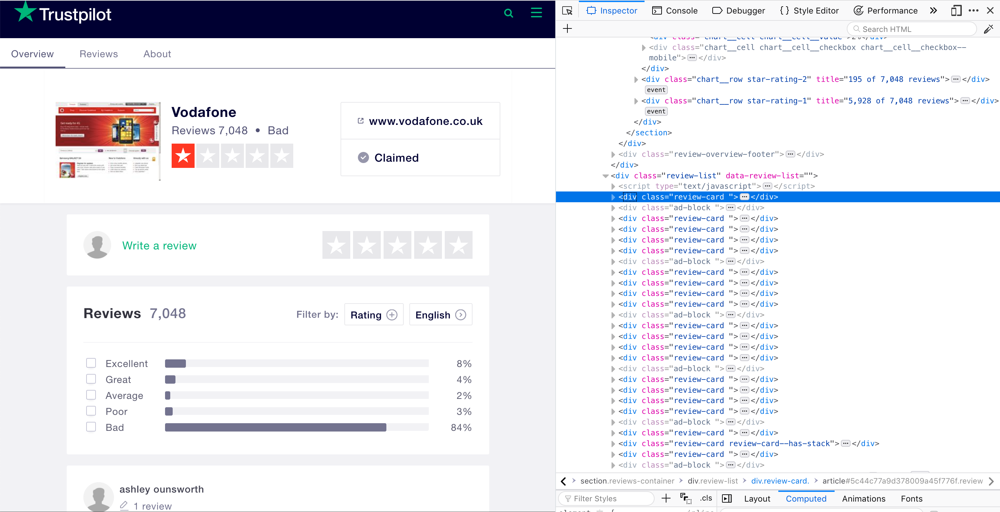
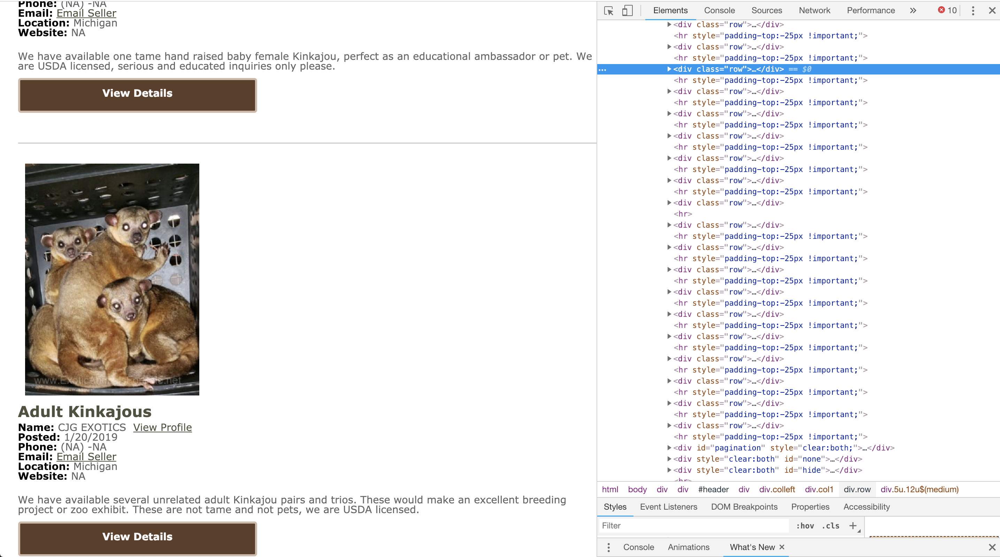

##  {data-background="./img/ucl_artwork/ucl-banner-land-darkblue-rgb.png" data-background-size="70%" data-background-position="top" data-background-opacity="1"}

Getting data from the Internet

Webscraping 2

## Today

- "Real" webscraping: basics of a webpage
- Access webpage in the wild
- Retrieve wild data
- Download data through webscraping

## APIs: Pros & Cons 

**Pro**

- easiy to access
- nicely documentation
- **works even if website changes**

**Cons**

- quota limits ($ $ $)
- under the platforms' control
- only for few platforms

##

### Don't let the data determine your research!


---

## COOL

But what about:


##


## No APIs

- incels.me
- stormfront
- 4chan

+ **APIs are restrictive!**

## ... what about:

### Your research question --> no API?


##

Main problem:

**Really ‘juicy’ data of the Internet** vs **APIs**


## "Real" webscraping: basics of a webpage

## Three elements of a webpage

1. Structure
2. Behaviour
3. Style

## Three elements of a webpage

1. Structure
2. Behaviour
    - JavaScript (**!= Java**)
    - user interaction
    - examples: alerts, popups, server-interaction
3. Style

## Three elements of a webpage

1. Structure
2. Behaviour
3. Style
    - CSS (Cascading Style Sheets)
    - formatting, design, responsiveness
    - examples: submit buttons, app interaces

## Three elements of a webpage

1. Structure
    - HTML (hypertext markup language)
    - structured with `<tags>`
    - contains the pure content of the webpage
2. Behaviour
3. Style

## For now: HTML

The very basics of HTML:

**Raw architecture of a webpage**

```{html}
<!DOCTYPE html>
<html>
<body>

HERE COMES THE VISIBLE PART!!

</body>
</html>
```


*Note:* Every tags `< >` is closed `< />`. Content is contained within the tag.

## HTML basics

Ways to put content in the `<body> ... </body>` tag:

- headings: `<h1>I'm a heading at level 1</>`


## Content in the body tag

- paragraphs: `<p>This is a paragraph</p>`


## Content in the body tag

- images: ``


## Content in the body tag

- links: `<a href="https://www.ucl.ac.uk/">Click here to go to UCL's website</a></a> `


## Content in the body tag

- tables

```{html}
<table>
  <tr>
    <th>Departments</th>
    <th>Location</th>
  </tr>
  <tr>
    <td>Dept. of Security and Crime Science</td>
    <td>Division of Psychology and Language Sciences</td>
  </tr>
  <tr>
    <td>35 Tavistock Square</td>
    <td>26 Bedford Way</td>
  </tr>
</table> 
```

## Html `<table>...</table>`


## Content in the body tag

- lists

```{html}
<ul>
  <li>Terrorism</li>
  <li>Cyber Crime</li>
  <li>Data Science</li>
</ul> 
```


## HTML basics

Elements (can) have IDs:

```{html}
<p id='paragraph1'>This is a paragraph</p>

```


Same for tables, links, etc.

Every element can have an ID.

You need unique IDs! Two elements cannot have the same ID.

## HTML basics

Common elements (can) have CLASSES:

```{html}
<p id="paragraph1" class="paragraph_class">I am the first paragraph</p>
<p class="paragraph_class">I am the second paragraph</p>
<p class="paragraph_class">I am the third paragraph</p>

```


Multiple elements can have the same class.

##

### Now what?

## Web scraping logic

If all webpages are built in this structure...

... then we could access this structure programmatically.

## But where do I find that structure?

Is it just "there"?

**YES!!**

## How to see the html structure?


##


##


##


##


## Example 1: Missing persons


## Example 1: Missing persons


## Example 2: FBI most wanted


## Webscraping in a nutshell

1. understand the structure of a webpage
2. exploit that structure for web-scraping

##

## Webscraping in practice

Case for today: Missing persons FBI

[https://www.fbi.gov/wanted/kidnap](https://www.fbi.gov/wanted/kidnap)

_Explore the target page_

## Aims

1. Get a list of all names
2. Store the bio information
3. Extract the "details" description
4. Download the poster

## Getting started

Set up your workspace first:

```{r}
library(rvest)

target_url = 'https://www.fbi.gov/wanted/kidnap'
```

## Remember...

- understanding the structure of a webpage
- exploiting that structure for web-scraping

## 1. Get a list of all names

_understanding the structure of a webpage_

[https://www.fbi.gov/wanted/kidnap](https://www.fbi.gov/wanted/kidnap)

## 1. Get a list of all names

_exploiting that structure for web-scraping_

Access the full html page (snapshot-mode):

```{r}
target_page = read_html(target_url)
target_page
```

## 1. Get a list of all names

Key here: look for the `<h3>` heading with class `title`:

```{r}
target_page %>%
  html_nodes('h3.title')

#note: equivalent to "html_nodes(target_page, 'h3.title')""
```

## 1. Get a list of all names

A closer look:

```{r}
all_titles = target_page %>%
  html_nodes('h3.title')

all_titles[1]
```

It's the text of the `<a href=...>` tag.

## 1. Get a list of all names

So what we want is:

1. Access the full html page
2. Search all h3 headings with class "title"
3. Find all `<a >` tags (= links)
4. Extract the text

## 1. Get a list of all names

1. Access the full html page `read_html(target_url)`
2. Search all h3 headings with class "title" `html_nodes('h3.title')`
3. Find all `<a >` tags (= links) `html_nodes('a')`
4. Extract the text `html_text()`

## 1. Get a list of all names

Combined:

```{r}
all_names = target_page %>%
  html_nodes('h3.title') %>%
  html_nodes('a') %>%
  html_text()
```

## 1. Get a list of all names

```{r}
all_names
```


## 2. Store the bio information

_understanding the structure of a webpage_

[https://www.fbi.gov/wanted/kidnap](https://www.fbi.gov/wanted/kidnap)

## 2. Store the bio information

We know: there's a table with class `wanted-person-description` that contains the data we want.

**But:** we need to access each 'kidnapped' person!?

For-loops to the rescue...

## 2. Store the bio information

_exploiting that structure for web-scraping_

So what we want is:

1. _Access the full html page_
2. _Search all h3 headings with class "title"_
3. _Find all `<a >` tags (= links)_
4. Extract the ~~text~~ actual link
5. Access that page
6. Extract the table with class `wanted-person-description`

## 2. Store the bio information

```{r}
all_persons_links = target_page %>%
  html_nodes('h3.title') %>%
  html_nodes('a') %>%
  html_attr('href')

all_persons_links
```

## 2. Store the bio information

Now what?

```{r}
for(i in all_persons_links){
  print(i)
}
```

## 2. Store the bio information

Before you write a loop...

```{r}
arianna = all_persons_links[1]
temp_target_url = arianna
temp_target_page = read_html(temp_target_url)
```
 
Single-case proof.

## 2. Store the bio information

```{r}
description = temp_target_page %>%
  html_nodes('table.wanted-person-description') %>%
  html_table()

description
```

## 2. Store the bio information

What we need for the for-loop:

1. do this for each link
2. store it somewhere (easiest: in a list)
3. log progress

## 2. Store the bio information

```{r}
list_for_data = list()
for(i in all_persons_links){
  print(paste('Accessing:', i))
  temp_target_url = i
  temp_target_page = read_html(temp_target_url)
  description = temp_target_page %>%
    html_nodes('table.wanted-person-description') %>%
    html_table()
  index_of_i = which(i == all_persons_links)
  list_for_data[[index_of_i]] = description
  print('--- NEXT ---')
}
```

## 2. Store the bio information

Now we have a list of tables.

Each table contains the details of one missing person:

```{r}
# thirteenth element in the list
list_for_data[[13]]
```

## 3. Extract the "details" description

_understanding the structure of a webpage_

[https://www.fbi.gov/wanted/kidnap](https://www.fbi.gov/wanted/kidnap)

## 3. Extract the "details" description

We want: the text of the `<div >` with class `wanted-person-details`

_exploiting that structure for web-scraping_

So what we want is:

1. _Access the full html page_
2. _Search all h3 headings with class "title"_
3. _Find all `<a >` tags (= links)_
4. Extract the ~~text~~ actual link
5. Access that page
6. Extract the ~~table with class `wanted-person-description`~~ `<div >` with class `wanted-person-details`

## 3. Extract the "details" description

Start with single-case proof:

```{r}
arianna = all_persons_links[1]
temp_target_url = arianna
temp_target_page = read_html(temp_target_url)

person_details = temp_target_page %>%
  html_nodes('div.wanted-person-details') %>%
  html_text()
```


## 3. Extract the "details" description

```{r}
person_details
```

## 3. Extract the "details" description

Putting it in a loop:

```{r}
list_for_person_details = list()
for(i in all_persons_links){
  print(paste('Accessing:', i))
  temp_target_url = i
  temp_target_page = read_html(temp_target_url)
  person_details = temp_target_page %>%
    html_nodes('div.wanted-person-details') %>%
    html_text()
  index_of_i = which(i == all_persons_links)
  list_for_person_details[[index_of_i]] = person_details
  print('--- NEXT ---')
}
```


## 3. Extract the "details" description

```{r}
#look at the 20th element
list_for_person_details[[20]]
```

## 4. Download the poster

_understanding the structure of a webpage_

[https://www.fbi.gov/wanted/kidnap](https://www.fbi.gov/wanted/kidnap)

## 4. Download the poster

What do we want?

_understanding the structure of a webpage_

Each kidnapped person has a 'download link'...

```{r eval=F}
https://www.fbi.gov/wanted/kidnap/arianna-fitts/download.pdf
```

Don't overthink it!

## 4. Download the poster

Compare these two:

```{r eval=F}
https://www.fbi.gov/wanted/kidnap/arianna-fitts/download.pdf
```

```{r}
arianna
```

Notice something?

## 4. Download the poster

We can just 'work around' this:

```{r}
download_url_arianna = paste(tolower(arianna), '/download.pdf', sep="")
download_url_arianna
```

[https://www.fbi.gov/wanted/kidnap/arianna-fitts/download.pdf](https://www.fbi.gov/wanted/kidnap/arianna-fitts/download.pdf)

## 4. Download the poster

Make use of R's vectorised structure:

```{r}
all_download_links = paste(tolower(all_persons_links), '/download.pdf', sep="")
all_download_links
```

## 4. Download the poster

Now:

1. access each
2. "download" (= write) the file
    - needs a filename on your computer

## 4. Download the poster

Create filenames:

```{r}
library(stringr)
file_names = paste(all_names, '.pdf', sep="")
file_names
```

## 4. Download the poster

Refine filenames:

```{r}
refined_file_names = tolower(str_replace_all(string = file_names, pattern = " ", replacement = "_"))
refined_file_names
```

## 4. Download the poster

Download each pdf from the url and use the refined filenames

```{r}
for(i in 1:length(all_download_links)){
  print(paste('Accessing URL: ', all_download_links[i], sep=""))
  download.file(url = all_download_links[i]
                , destfile = refined_file_names[i]
                , mode = "wb")
}
```


## Notes on webscraping

- highly customisable (= juicy data)
- basically: "anything goes"
- can be unstable/sensitive to html changes

## What this means

Same idea, different code details:


## What this means

Same idea, different code details:



## What this means

Same idea, different code details:



## What this means

Same idea, different code details:



## RECAP

- **Always: problem first, never the method first!**
- **Method follows problem!**
- HTML structure key to 'real' webscraping
- Webscraping:
    - understanding the structure of a webpage
    - exploiting that structure for web-scraping
- principle is always the same: understand + exploit the html structure

## Outlook

**Tutorial:** APIs + Webscraping in R

**Homework:** Do the readings for today (blogposts/guides)

**Next week:** Text data 1

## END
