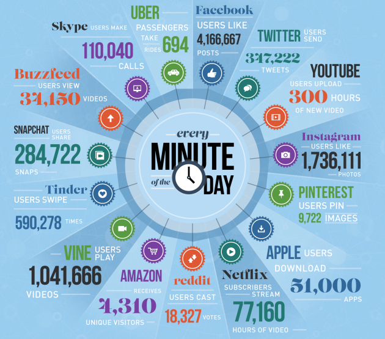
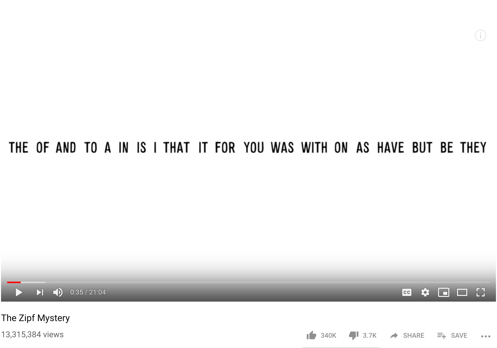

##  {data-background="./img/ucl_artwork/ucl-banner-land-darkblue-rgb.png" data-background-size="70%" data-background-position="top" data-background-opacity="1"}

Text data 1


## Briefly about the module {.left_aligned}

- 0.5 UCL credits = 7.5 ECTS
- 150 learning hours
- 11 weeks with 14 hours/week
- 3 contact hours per week
- **leaves 11 hours of self-study per week**


## Expected self-study {.left_aligned}

- Revise the lecture (your responsibility)
- Replicate the code/examples
- Read the required literature (read, annotate, summarise)
- Read additional literature if necessary
- Design own code examples to understand the concept
- Find tutorials/guides online
- If still unclear: attend the code clinics: **Weds 10-11 am**
- or: post it on Moodle or ask us


## Today {.left_aligned}

- Why text data?
- Applications to crime and security problems
- Levels of text data
- Quantifying text data
- Considerations in text cleaning

##

## 



## Text is everywhere ...  {.left_aligned}

- Practically all websites
- Emails
- Messaging
- Government reports
- Laws
- Police reports
- Uni coursework
- Newspapers

## ... and everything is text  {.left_aligned}

- videos --> transcripts
- music --> lyrics
- conversations --> transcripts
- speeches --> transcripts

## Core idea

Text is a unique documentation of human activity.

_We are obsessed with documenting._

## 

### Text & Crime Science

## Text & Crime Science

- hate speech
- police reports
- crimestoppers
- fake reviews
- fear of crime
- cryptofraud


## Obtaining text data


##

### Quantifying text data

## Challenge of quantification {.left_aligned}

- a text is not a numerical representation
- compare this to trading data
- a text is just that, "a text"
- but: for quantitative analyses, we need numbers

Text --> numerical representation?

## Example

  > All I ever wanted was to love women, and in turn to be loved by them back. Their behavior towards me has only earned my hatred, and rightfully so! I am the true victim in all of this. I am the good guy. Humanity struck at me first by condemning me to experience so much suffering. I didn’t ask for this. I didn’t want this. I didn’t start this war. I wasn’t the one who struck first. But I will finish it by striking back. I will punish everyone. And it will be beautiful. Finally, at long last, I can show the world my true worth.

##

### How would you quantify the example?

## Features of text data {.left_aligned}

- meta dimension
    - no. of words
    - no. of sentences
- syntactic dimension
    - word frequencies
    - verbs, nouns, persons, locations, ..
    - structure of a sentence
- semantic dimension
    - sentiment
    - psycholinguistic features
- text metrics
    - readability
    - lexical diversity

## Approaches to text data {.left_aligned}

1. Modelling text data
2. Comparing text data
3. Text data for predictive models

## The `quanteda` package {.left_aligned}

```{r}
library(quanteda)
```

- [quanteda: Quantitative Analysis of Textual Data](https://quanteda.io/)
    - documentation
    - tutorials
    - examples


## Levels of text data {.left_aligned}

- characters `c('h', 'a', 't', 'r', 'e', 'd')`
- words `hatred`
- sentences `I didn’t ask for this.`
- documents: individual text files
- corpora: collection of documents

```{r echo=F}
er = "All I ever wanted was to love women, and in turn to be loved by them back. Their behavior towards me has only earned my hatred, and rightfully so! I am the true victim in all of this. I am the good guy. Humanity struck at me first by condemning me to experience so much suffering. I didn’t ask for this. I didn’t want this. I didn’t start this war. I wasn’t the one who struck first. But I will finish it by striking back. I will punish everyone. And it will be beautiful. Finally, at long last, I can show the world my true worth."
```

## Counting meta features in R {.left_aligned}

| text level| R function  |
|----------:|------------:|
| characters| `nchar()`|
| words| `quanteda::ntoken()`|
| sentences| `quanteda::nsentence()`|

Homework: read about the type/token distinction [here](https://rdrr.io/cran/quanteda/man/ntoken.html) and [here](https://plato.stanford.edu/entries/types-tokens/#WhaDis).

## R examples

```{r}
#sentences
no_of_sentences = nsentence(er)
no_of_sentences

#words 1
no_of_words_1 = ntoken(er)
no_of_words_1

#words 2
no_of_words_2 = ntype(er)
no_of_words_2
```

## Type-toke ratio {.left_aligned}

Note: often used metric for "lexical diversity" is the TTR (type-token ratio).

```{r}
string_a = "I didn’t ask for this. I didn’t want this."
string_b = "But I will finish it by striking back."
```

**What are the type-token ratios of each string?**

## Type-token ratio

```{r}
ntype(string_a)/ntoken(string_a)
```

```{r}
ntype(string_b)/ntoken(string_b)
```

## Nuanced meta features

- Characters per word

```{r}
nchar(er)/ntoken(er)
```

- Words per sentence

```{r}
ntoken(er)/nsentence(er)
```

##

### Text representations

## Text representations {.left_aligned}

- represent a text by its tokens (terms)
- each text consists of a frequency of its tokens

```{r eval=F}
"I think I believe him"
```

- create a column for each token
- count the frequency

| text_id| I | think | believe | her |
|-------:|-------:|-------:|-------:|-------:|
| text1| 2 | 1 | 1 | 1 |

## Term frequency {.left_aligned}

- frequency of tokens in each document
- represented in a table (matrix)
- tokens are features of a document
- voilá: fancy name --> **Document Feature Matrix (= DFM)**

```{r}
example_string_tok = tokens("I think I believe him")
```

## DFM {.left_aligned}

- from 'tokens' object, create a DFM table

```{r}
dfm(example_string_tok)
```

- Sparsity: % of zero-cells
    - why is sparsity = 0% here?
    - what would you expect if we take additional documents

## DFM with multiple documents {.left_aligned}

_Document-term frequency matrix_

```{r}
multiple_docs_tok = tokens(c("I think I believe him", "This is a cool function"))
```

```{r}
dfm(multiple_docs_tok)
```


## DFM with two lone-actors {.left_aligned}


  > "All I ever wanted was to love women, and in turn to be loved by them back. Their behavior towards me has only earned my hatred, and rightfully so! I am the true victim in all of this. I am the good guy. Humanity struck at me first by condemning me to experience so much suffering. I didn’t ask for this. I didn’t want this. I didn’t start this war. I wasn’t the one who struck first. But I will finish it by striking back. I will punish everyone. And it will be beautiful. Finally, at long last, I can show the world my true worth."

## DFM with two texts

```{r echo=F}
ub = "The Industrial Revolution and its consequences have been a disaster for the human race. They have greatly increased the life-expectancy of those of us who live in “advanced” countries, but they have destabilized society, have made life unfulfilling, have subjected human beings to indignities, have led to widespread psychological suffering (in the Third World to physical suffering as well) and have inflicted severe damage on the natural world. The continued development of technology will worsen the situation."
```

  > The Industrial Revolution and its consequences have been a disaster for the human race. They have greatly increased the life-expectancy of those of us who live in “advanced” countries, but they have destabilized society, have made life unfulfilling, have subjected human beings to indignities, have led to widespread psychological suffering (in the Third World to physical suffering as well) and have inflicted severe damage on the natural world. The continued development of technology will worsen the situation.

## DFM representation  {.left_aligned}

- Create a "mini corpus" for convenience
- makes using the quanteda pipeline easier

```{r}
mini_corpus = corpus(c(er, ub))
summary(mini_corpus)
```

## DFM representation

```{r}
corpus_tokenised = tokens(mini_corpus)
corpus_dfm = dfm(corpus_tokenised)
```

```{r}
knitr::kable(corpus_dfm[, 1:8])
```

## ... 

```{r}
knitr::kable(corpus_dfm[, 31:38])
```

**Is this ideal?**

## What are the most frequent "terms"?

```{r}
topfeatures(corpus_dfm[1])
```

```{r}
topfeatures(corpus_dfm[2])
```


Highly recommended: [Vsauce on Zipf's Law](https://www.youtube.com/watch?v=fCn8zs912OE)

## 



## Word hierarchies  {.left_aligned}

- some words at more meaning than others
- stopwords = meaningless (?)
- in any case: too frequent words, don't tell much about the documents
- ideally: we want to get an "importance score" for each word

##

### But how to get the important words?

## Word importance

```{r echo=F}
knitr::kable(corpus_dfm[, 10:15])
```

Ideally, we want to "reward" words that are:

- important locally
- but not 'inflated' globally

## Metric for word importance

- Term frequency: occurence/overall words in document

```{r echo=F}
knitr::kable(round(dfm_weight(corpus_dfm, scheme = 'prop'), 3)[, 10:15])
```

```{r}
3/ntoken(mini_corpus[1])
```

Term frequency: reward for words that occur often in a document.

## Metric for word importance

Problem: some words just occur a lot anyway (e.g. "stopwords").

Correct for global occurrence:

```{r echo=F}
knitr::kable(docfreq(corpus_dfm, scheme = 'count')[10:15])
```

Document frequency: number of documents with each token.

## Combining term frequency and document frequency

- take the local importance

```{r echo=F}
knitr::kable(round(dfm_weight(corpus_dfm, scheme = 'prop'), 3)[, 10:12])
```

- correct for global occurrences

```{r echo=F}
knitr::kable(docfreq(corpus_dfm, scheme = 'count')[10:12])
```

## TF/DF

```{r eval=F}
#text1: "and"
0.024/2

#text2: "and"
0.022/2
```

```{r eval=F}
#text1: "turn"
0.008/1

#text2: "turn"
0.000/1
```


## TF-IDF

- Term frequency
- INVERSE document frequency

$TFIDF = TF/DF$ = $TFIDF = TF*IDF$, since

$IDF = 1/DF$


## TF-IDF

```{r}
knitr::kable(round(dfm_tfidf(corpus_dfm, scheme_tf = 'prop', scheme_df = 'count'), 3)[, 10:15])
```


## TF-IDF

- TF: rewards local importance
- IDF: punishes for global occurrence
- TFIDF value as metric for the importance of words per document

## There's more to words

- you can count them [DONE]
- but they also have a function
    - each word has a grammatical function
    - nouns, verbs, pronouns
- called: parts-of-speech

## Syntactic dimension

```{r message=F}
library(qdap)
```

```{r echo=F}
er_tokenised = tokens(er)
knitr::kable(er_tokenised$text1[1:8])
```

## Part-of-speech tagging

POS depend on POS framework.  
Commonly used: [Penn Treebank Project](https://www.ling.upenn.edu/courses/Fall_2003/ling001/penn_treebank_pos.html)

|x      | POS|
|:------|:------|
|All    | determiner|
|I      | noun|
|ever   | adverb|
|wanted | verb|
|was    | verb|
|to     |   ?  |
|love   | verb|
|women  | noun|


## POS types

```{r echo=F}
knitr::kable(pos_tags(type='pretty')[1:12, ])
```

## POS tagging with `qdap`

```{r message=F}
er_ = "All I ever wanted was to love women"
pos_tagged = pos(er_)
pos_tagged$POStagged$POStagged
```

## POS tagging

```{r message=F}
pos(er, percent = F, progress.bar = F)$POSfreq
```


```{r message=F}
pos(ub, percent = F, progress.bar = F)$POSfreq
```

##

### Considerations in text cleaning

## Researcher's degrees of freedom

- stopword removal
- stemming

## Stopword removal

- We know many words are "low in meaning"
- So-called stopwords

```{r echo=F}
knitr::kable(stopwords()[c(1:5, 20:25)])
```

You could decide to remove these...

## Stopword removal

With stopwords:

```{r echo=F}
knitr::kable(corpus_dfm[, 1:8])
```


Without stopwords

```{r echo=F}
corpus_dfm_sw_removed = dfm(corpus_tokenised, remove = stopwords())
knitr::kable(corpus_dfm_sw_removed[, 1:8])
```

## Stemming

- some words originate from the same "stem"
- e.g. "love", "loved", "loving", "lovely"
- but you might want to reduce all these to the stem

## Word stems

```{r}
love_stem = c("love", "loved", "loving", "lovely")
```


```{r echo=F}
love_stem_tok = tokens(love_stem)
knitr::kable(dfm(love_stem_tok))
```

## ... after stemming

```{r}
knitr::kable(dfm(love_stem_tok, stem = T))
```


## Our mini corpus

From: (incl. stopwords and without stemming)

```{r echo=F}
knitr::kable(corpus_dfm[, 1:8])
```

... to (without stopwords and stemmed)

```{r echo=F}
corpus_dfm_sw_removed_stemmed = dfm(corpus_tokenised, remove = stopwords(), stem = T)
knitr::kable(corpus_dfm_sw_removed_stemmed[, 1:8])
```

##

## Limitations of text data {.left_aligned}

- a lot of assumptions
- text == behaviour?
- produced text == displayed text?
- linguistic "profiles"
- many decisions in your hand
    - stemming
    - stopwords
    - custom dictionary

## RECAP

- levels of text data
- meta features
- syntactic features
  - word frequencies
  - TFIDF
  - parts-pf-speech

## Outlook

No tutorial.

**Homework:** Text data 1 (to come)

**Next week:** Text data 2

## END
