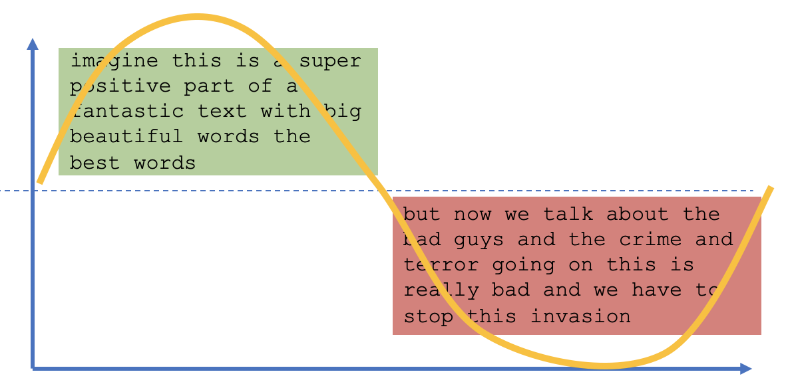

##  {data-background="./img/ucl_artwork/ucl-banner-land-darkblue-rgb.png" data-background-size="70%" data-background-position="top" data-background-opacity="1"}

Text data 2

## Today {.left_aligned}

- Recap TF-IDF
- n-grams
- psycholinguistics
- sentiment analysis

##

## Recap: TFIDF

Why do we need the TF-IDF? 

And what is it?

## TF-IDF example {.left_aligned}

Fakenews corpus: 1000 fake, 1000 real [(data)](https://github.com/sophiabiancalatessa/FakeNewsDeepLearning/tree/master/data/processed)

**Step 1: Term-frequencies**

```{r echo=F}
library(quanteda)
load('./data/fakenews_corpus.RData')
corpus_tokenised = tokens(fakenews_corpus)
```

##

```{r}
corpus_dfm = dfm(corpus_tokenised
                 , stem = T
                 , remove = stopwords())
dfm_trimmed = dfm_trim(corpus_dfm, sparsity = 0.95)
dfm_trimmed_tf = round(dfm_weight(dfm_trimmed, scheme='prop'), 4)
dfm_trimmed_tf
```

## TF (proportions)

```{r echo=F}
knitr::kable(dfm_trimmed_tf[1:5, 1:8])
```

## Step 2: DF

```{r echo=F}
knitr::kable(docfreq(dfm_trimmed, scheme = 'count')[1:8])
```

## Step 2: DF

[Inverse DF with log transform](https://quanteda.io/reference/docfreq.html)

```{r echo=F}
knitr::kable(docfreq(dfm_trimmed, scheme = 'inverse')[1:8])
```

## Step 3: TF-IDF

```{r eval=F}
dfm_tfidf(dfm_trimmed
          , scheme_tf = 'prop'
          , scheme_df = 'inverse') ##!!! <-- correction to L4
```


```{r echo=F}
knitr::kable(round(dfm_tfidf(dfm_trimmed
                             , scheme_tf = 'prop'
                             , scheme_df = 'inverse') ##!!! <-- correction to L4
                   , 4)[1:5, 1:8])
```

## TF-IDF formal

- Term frequency
- INVERSE document frequency

$TFIDF = TF/DF$ = $TFIDF = TF*IDF$, since

$IDF = 1/DF$

Note: [types of DF](https://quanteda.io/reference/docfreq.html)

## TF-IDF aims

- TF: rewards local importance
- IDF: punishes for global occurrence
- TFIDF value as metric for the importance of words per document

##

### Extension: _n_-grams

## Problem?

```{r echo=F}
extract = 'It is a great time to be alive'
extract
```

## So far...

- we used tokens as unit of analysis
- but: sometimes mutlple tokens might reveal more
- n-grams --> sequences of _n_ tokens
    - unigrams: n = 1
    - bigrams: n = 2
    - trigrams: n = 3


## Unigrams

```{r echo=F}
extract
```

## Unigrams

```{r echo=F}
ngrams_extract_1 = dfm(x = extract
                       , ngrams = 1
                       , verbose = F
                       , remove_punct = T
                       , stem = F
                       )
ngrams_extract_1
```

## Beyond unigrams: bigrams

Bigrams = all sequenceis of 2 tokens

```{r echo=F}
extract
```

## Bigrams

```{r echo=F}
ngrams_extract_2 = dfm(x = extract
                       , ngrams = 2
                       , verbose = F
                       , remove_punct = T
                       , stem = F
                       )
ngrams_extract_2
```

## Even more ...

Trigrams

```{r echo=F}
ngrams_extract_3 = dfm(x = extract
                       , ngrams = 3
                       , verbose = F
                       , remove_punct = T
                       , stem = F
                       )
ngrams_extract_3
```

## n-grams in general

**What happens when we increase _n_ in a corpus?**

## n-grams with quanteda

```{r}
unigrams = dfm(x = fakenews_corpus
               , ngrams = 1
               )
```

```{r echo=F}
knitr::kable(unigrams[1:5, 1:8])
```

## dfm with additional controls

```{r}
unigrams_cleaned = dfm(x = fakenews_corpus
               , ngrams = 1
               , stem = T
               , remove = stopwords()
               )
```

```{r echo=F}
knitr::kable(unigrams_cleaned[1:5, 1:6])
```

## Bigrams

```{r}
bigrams_cleaned = dfm(x = fakenews_corpus
               , ngrams = 2 ## <---!!!
               , stem = T
               )
```

```{r echo=F}
knitr::kable(bigrams_cleaned[1:5, 1:4])
```

## 

**What happens when we increase _n_ in a corpus?**

```{r}
dim(unigrams_cleaned)
```

```{r}
dim(bigrams_cleaned)
```

## Weighting n-grams

```{r eval=F}
dfm_tfidf(bigrams_cleaned
          , scheme_tf = 'prop'
          , scheme_df = 'inverse')
```


```{r echo=F}
knitr::kable(round(dfm_tfidf(bigrams_cleaned
                             , scheme_tf = 'prop'
                             , scheme_df = 'inverse')
                   , 4)[1:5, 1:4])
```

## _n_-grams

- generalisation of "single" tokens
- often used in [bag-of-word models](https://www.datacamp.com/courses/intro-to-text-mining-bag-of-words)
- common in predictive modelling

## 

##

### Sentiment analysis

## Sentiment analysis: aim

- measure positive/negative tone
- "emotionality" of a text
- builds on the "language -> behavior" and "cognition -> language" nexus

## Basics of sentiment analysis

1. tokenise text
2. construct a lexicon of sentiment words
3. judge the sentiment words
4. match tokens with sentiment lexicon

## 1. tokenise text

From:

```{r echo=F}
fakenews_corpus$documents$texts[410]
```

... to

```{r echo=F}
tokens(fakenews_corpus$documents$texts[410])
```

## 2. lexicon of sentiment words

- do all words have a potential sentiment?
- maybe focus on adjectives/adverbs, maybe verbs?


Luckily: many sentiment lexicons exists

## 2. lexicon of sentiment words

The `lexicon` [package](https://github.com/trinker/lexicon)

```{r}
lexicon::hash_sentiment_nrc[, 1]
```

## 2. lexicon of sentiment words

```{r}
lexicon::hash_sentiment_slangsd[, 1]
```

## 2. lexicon of sentiment words

```{r}
lexicon::hash_sentiment_socal_google[, 1]
```

## 3. judge the sentiment words

Normal strategy

- crowdsourced annotation
- decide on judgment scale
- multiple judgments per word
- assess inter-rater reliability

## 3. judge the sentiment words

Again: mostly already done for you

```{r}
lexicon::hash_sentiment_nrc
```

Binary judgment: -1 or 1

## 3. judge the sentiment words

```{r}
lexicon::hash_sentiment_slangsd
```

Finer judgment: -1.00, -0.50, 0.50, 1.00

## 3. judge the sentiment words

```{r}
lexicon::hash_sentiment_socal_google
```

Continuous scale: -30 to +30

## 4. match tokens with sentiment lexicon

- Classic approach: one sentiment score [(`syuzhet` package)](https://github.com/mjockers/syuzhet)

```{r echo=F}
example_text = 'An author of many childrens was devastated when she found out that she had colon cancer. She entered the third phase of her cancer. It was especially terrifying because her husband passed away from lung cancer after receiving chemotherapy. She opted not to take the same path I was exposed to. However after six months the cancer was spread to the lungs and entered the fourth stage.'
```

> [...] was devastated when she found out that she had colon cancer. She entered the third phase of her cancer. It was especially terrifying because her husband passed away from lung cancer after receiving chemotherapy. [...]

## 4. match tokens with sentiment lexicon

Classic approach: one sentiment score

```{r}
syuzhet::get_sentiment(example_text)
```

## 4. match tokens with sentiment lexicon

- Newer approach: sentiment for each sentence

The `sentimentr` [(Rinker)](https://github.com/trinker/sentimentr) package

```{r}
sentimentr::sentiment(example_text)
```

## 4. match tokens with sentiment lexicon

- Newer approach: sentiment for each sentence
    - needs punctuated data
    - and good sentence disambiguation
    - without punctuation: whole string = 1 sentence
- What about valence shifters?
    
This is not ideal.

## A different approach

**Dynamic sentiment analysis**

- Inspired by: Matthew Jockers' [work](http://www.matthewjockers.net/2015/02/02/syuzhet/)

Assumption:

- sentiment is dynamic within texts
- static approaches mask sentiment dynamics
- worst case: sentiment completely off

##


##



## Sentiment trajectories

From our [EMNLP work](https://arxiv.org/abs/1808.09722)

1. Parse text input into words
2. Match sentiment lexicon to each word
    - Match valence shifters to each context 
        - Apply valence shifter weights
        - Build a naïve context around the sentiment
	      - Return modified sentiment
3. Length-standardise sentiment vector

## Sentiment trajectories

Parse input

```{r}
source('./r_deps/naive_context_sentiment/ncs.R')
```

```{r echo=F}
library(stringr)
library(data.table)
mod_string = str_replace_all(example_text, "[.,;:!?]", "")
mod_string = tolower(mod_string)
mod_string = unlist(str_split(mod_string, " "))
mod_string = mod_string[nchar(mod_string) > 0]

#transform to data table
text.raw = data.table(text = mod_string
                      , index = 1:length(mod_string))

knitr::kable(text.raw[25:35,])
```

## Sentiment trajectories

Match sentiment

```{r echo=F}
hash.sentiment = lexicon::hash_sentiment_jockers_rinker
hash.valence_shifters = lexicon::hash_valence_shifters

#locate sentiments
text.sentiment = merge(text.raw
                       , hash.sentiment
                       , by.x = 'text'
                       , by.y = 'x'
                       , all.x = TRUE)
text.sentiment = text.sentiment[order(index),]

knitr::kable(text.sentiment[25:35,])

```

## Sentiment trajectories

Match valence shifters

```{r echo=F}
#locate valence shifters
text.valence_shifters = merge(text.sentiment
                              , hash.valence_shifters
                              , by.x = 'text'
                              , by.y = 'x'
                              , all.x = TRUE)
text.valence_shifters = text.valence_shifters[order(index),]

text.table = text.valence_shifters

knitr::kable(text.table[25:35,])
```

## Sentiment trajectories

Valence shifters

- 1 = negator (not, never, …):-1.00
- 2 = amplifier (very, totally, …): 1.50
- 3 = deamplifier (hardly, barely, …): 0.50
- 4 = adversative conjunction (but, however, …): 0.25

## Sentiment trajectories

Apply valence shifter weights

```{r echo=F}
cluster_lower_ = 2
cluster_upper_ = 2
weight_negator_ = -1
weight_amplifier_ = 1.5
weight_deamplifier_ = 0.5
weight_advcon_ = 0.25
names(text.table)[3:4] = c('sentiment'
                           , 'valence'
)

#key to valence shifters:
#1 = negator
#2 = amplifier
#3 = deamplifier
#4 = adversative conjunction
text.table$weights = ifelse(is.na(text.table$valence), 1,
                            ifelse(text.table$valence == 1, weight_negator_,
                                   ifelse(text.table$valence == 2, weight_amplifier_,
                                          ifelse(text.table$valence == 3, weight_deamplifier_,
                                                 weight_advcon_))))

text.table$sentiment_score = text.table$sentiment
text.table$sentiment_score[is.na(text.table$sentiment_score)] = 0
text.table$sentiment_score_mod = text.table$sentiment_score

knitr::kable(text.table[25:35, 1:5])
```

## Sentiment trajectories

Build 'naive' context around sentiment

- 2 words around sentiment word

|text       | index| sentiment|valence | weights|
|:----------|-----:|---------:|:-------|-------:|
|**was**        |    26|        NA|NA      |     1.0|
|**especially** |    27|        NA|2       |     1.5|
|**terrifying** |    28|        -1|NA      |     1.0|
|**because**    |    29|        NA|NA      |     1.0|
|**her**        |    30|        NA|NA      |     1.0|


## Sentiment trajectories

Calculate modified sentiment

```{r echo=F, message=FALSE}
verbose=T
for(i in 1:length(text.table$sentiment_score)){
  if(text.table$sentiment_score[i] != 0){
    cluster_boundary_lower = ifelse((i-cluster_lower_) > 0, (i-cluster_lower_), 1)
    cluster_boundary_upper = ifelse((i+cluster_upper_) < length(text.table$sentiment_score), (i+cluster_upper_), length(text.table$sentiment_score))
    a = text.table$weights[cluster_boundary_lower:cluster_boundary_upper]
    a[(1+cluster_lower_)] = text.table$sentiment_score[i]
    text.table$sentiment_score_mod[i] = prod(a, na.rm = T)
    
    if(verbose == T){
      print(paste('sentiment change for "', text.table$text[i], '": ',  text.table$sentiment_score[i], ' --> ', prod(a), sep=""))
      
    }
    
  }
}
```

```{r echo=F}
knitr::kable(text.table[26:30, c(1,3,4,5,7)])
```

## Sentiment trajectories

Length-standardisation

```{r echo=F}
library(syuzhet)
text.scored_binned = get_dct_transform(text.table$sentiment_score_mod
                                        , x_reverse_len=100
                                        , low_pass_size = 5
                                        , scale_range = T
                                        , scale_vals = F)
```

- aim: transform all sentiments (modified + valence-shifter weighted) to a vector
- standard vector length for comparisons
- here: 100 values with [Discrete Cosine Transformation](https://en.wikipedia.org/wiki/Discrete_cosine_transform)

## Sentiment trajectories

Length-standardisation

```{r echo=F}
plot(text.scored_binned
     , type='h'
     , ylim = c(-1.25, 1.25)
     , main = 'Example text'
     , ylab = 'Sentiment'
     , xlab = 'Standardized narrative time'
     , col = ifelse(text.scored_binned > 0, 'blue', 'red'))

```

##

##

### Psycholinguistics

## Psycholinguistics

Die-hard assumption: cognition --> language

- assuming that cognition --> language
- we might be interested in knowing about:
    - complex thinking in text
    - tentative language vs certainty
    - focus on past/present/future
    - ...


## The LIWC (read as "luke")

- developed at UT Austin
- Several [papers](https://www.cs.cmu.edu/~ylataus/files/TausczikPennebaker2010.pdf)
- Built with expert focus groups
- Popular in CL community
- dictionary-based approach
- 92 categories

## The LIWC pipeline

- read individual files into the LIWC software
- select categories
- retrieve % of words in category

## 

### LIWC demo

## LIWC output: Meta indicators

```{r echo=F}
library(data.table)
liwc_output = fread('./data/fakenews_liwc.txt', header=T)
liwc_output = liwc_output[, -c(1,2)]
knitr::kable(liwc_output[2:5, 1:9])
```


## LIWC output: Linguistic processes

```{r echo=F}
knitr::kable(liwc_output[2:5, 9:16])
```

## LIWC output

```{r echo=F}
knitr::kable(liwc_output[12:15, 19:28])
```

## LIWC output: Psychological processes

```{r echo=F}
knitr::kable(liwc_output[12:15, 30:37])
```

## LIWC output: Psychological processes

```{r echo=F}
knitr::kable(liwc_output[12:15, 40:46])
```


## LIWC output: Personal concerns

```{r echo=F}
knitr::kable(liwc_output[12:15, 70:75])
```

## LIWC output: Informal language

```{r echo=F}
knitr::kable(liwc_output[12:15, 75:81])
```

## LIWC output: Punctuation

```{r echo=F}
knitr::kable(liwc_output[2:5, 82:90])
```


## RECAP

- ngrams as generalisation of single-token analyses
- sentiment analysis in general
- sentiment trajectories
- psycholinguistics with the LIWC

## Outlook

Tutorial tomorrow

**Next week:** Reading week

Week 6: Machine learning 1

## END
