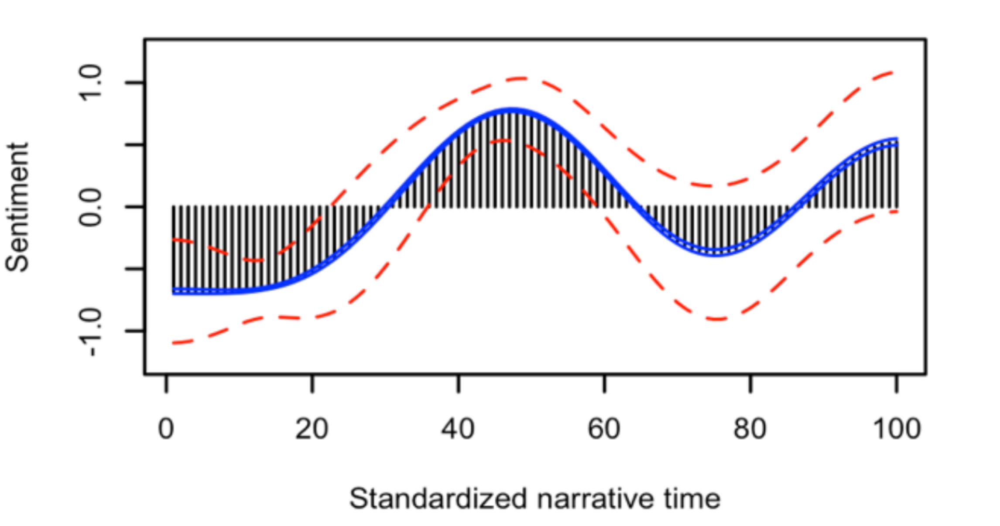

##  {data-background="./img/ucl_artwork/ucl-banner-land-darkblue-rgb.png" data-background-size="70%" data-background-position="top" data-background-opacity="1"}

MACHINE LEARNING 2

## Today {.left_aligned}

- Recap supervised machine learning
- UNsupervised ML
    - Step-by-step example
- Performance metrics
- Validation and generalisation

## Recap supervised ML

- supervised = labeled data
    - classification (e.g. death/alive, fake/real)
    - regression (e.g. income, number of deaths)
- step-wise procedure

## Steps in supervised ML

- clarify what `outcome` and `features` are
- determine which classification algorithm to use
- train the model
    - train/test split
    - cross-validation
- fit the model

## 

### Unsupervised ML

##

- often we don't have labelled data
- sometimes there are no labels at all
- core idea: finding clusters in the data

```{r message=F}
library(caret)
```

## Examples

- grouping of online ads
- clusters in crime descriptions
- ...

Practically everywhere. 

Clustering reduces your data!

## 

```{r echo=F}
set.seed(123456)
data2 = data.frame(gender = rep(c('male', 'female'), each=300)
                   , salary = round(c(rnorm(300, 38000, 4000), rnorm(300, 25000, 8000)), 0)
                   , height = round(c(rnorm(300, 180, 10), rnorm(300, 165, 10)), 0))
{plot(data2$salary, data2$height, col=data2$gender)
  legend("topleft" 
  , legend = c("Male", "Female")
  , col = c('red', 'black')
  , pch = c(1))}
```

## The unsupervised case

You know nothing about groups inherent to the data.

```{r echo=F}
data3 = data2
data3$salary = scale(data2$salary)
data3$height = scale(data2$height)
plot(data3$salary, data3$height, ylim=c(-3, 3), xlim=c(-3,3))
data4 = data3[, 2:3]
```

## The k-means idea

- separate data in set number of clusters
- find best cluster assignment of observations

## Stepwise

1. set the number of clusters
2. find best cluster assignment

## 1. no. of clusters

Let's take 4.

```{r}
unsup_model_1 = kmeans(data4
                       , centers = 4
                       , nstart = 10
                       , iter.max = 10)
```

## What's inside?

```{r echo=F, warning=F, message=F}
c1 = kmeans(data4, centers = 4, iter.max = 1)
c2 = kmeans(data4, centers = c1$centers, iter.max = 1)

{plot(data4$salary, data4$height, col=c1$cluster, pch=16, main="Iteration: 1")
points(c1$centers, col=1:4,pch=4,cex=3, lwd=4)}
```

##

```{r echo=F}
{plot(data4$salary, data4$height, col=c2$cluster, pch=16, main="Iteration: 2")
points(c2$centers, col=1:4,pch=4,cex=3, lwd=4)}
```


##

```{r message=F, echo=F}
library(factoextra)
fviz_cluster(unsup_model_1, geom = "point", data = data4)
```

## The k-means algorithm

- find random centers
- assign each observation to its closest center
- optimise for the WSS

## 

### What's problematic here?

## But how do we know how many centers?

Possible approach: 

- run it for several combinations
- assess the WSS
- determine based on scree-plot

## Cluster determination

```{r}
wss = numeric()
for(i in 1:20){
  kmeans_model = kmeans(data4, centers = i, iter.max = 20, nstart = 10)
  wss[i] = kmeans_model$tot.withinss
}
```


## Scree plot (elbow method)

Look for the inflexion point at center size _i_.

```{r echo=F}
plot(1:20, wss, type='b')
```

## Other methods to establish _k_

- Silhoutte method (cluster fit)
- Gap statistic

See also [this](https://uc-r.github.io/kmeans_clustering) tutorial.


## Silhouette method

```{r echo=F}
fviz_nbclust(data4, kmeans, method = "silhouette")
```

## Gap statistic

```{r echo=F, message=F, warning=F}
library(cluster)
set.seed(123)
gap_stat = clusGap(data4, FUN = kmeans, nstart = 25, K.max = 10, B = 50)
fviz_gap_stat(gap_stat)
```

## Choosing _k_

We settle for $k = 2$

```{r}
unsup_model_final = kmeans(data4
                       , centers = 2
                       , nstart = 10
                       , iter.max = 10)
```


## Plot the cluster assignment

```{r echo=F}
fviz_cluster(unsup_model_final, geom = "point", data = data4)
```

## Other unsupervised methods

- k-means (today)
- hierarchical clustering
- density clustering

## Issues with unsupervised learning

What's lacking?

What can you (not) say?

## Caveats of unsup. ML

- there is no "ground truth"
- interpretation/subjectivity
- cluster choice

## Interpretation of findings

```{r echo=F}
fviz_cluster(unsup_model_final, geom = "point", data = data4)
```

## Interpretation of findings

```{r}
unsup_model_final$centers
```

- Cluster 1: low salary, small
- Cluster 2: high salary, tall

Note: we cannot say anything about accuracy.

See the [k-NN model](https://www.datacamp.com/community/tutorials/machine-learning-in-r#six).

## Interpretation of findings



## Interpretation of findings

- subjective
- labelling tricky
- researchers choice!
- be open about this

## Cluster choice

What if we chose $k=3$?

```{r}
km_3 = kmeans(data4, centers = 3, nstart = 10, iter.max = 10)
fviz_cluster(km_3, geom = "point", data = data4)
```

## Cluster choice

What if we chose $k=3$?

```{r}
km_3$centers
```

- Cluster 1: high salary, very tall
- Cluster 2: very low salary, small
- Cluster 3: avg salary, small

## Cluster choice

- be open about it
- make all choices transparent
- always share code and data ("least vulnerable"" principle)

------

##

## 

### Performance metrics for classification tasks

## Fake news problem

```{r message=F, echo=F, warning=F}
library(quanteda)
library(caret)
load('./data/fakenews_corpus.RData')
corpus_tokenised = tokens(fakenews_corpus)
ngrams_extract_1 = dfm(x = corpus_tokenised
                       , ngrams = 1
                       , verbose = F
                       , remove_punct = T
                       , stem = F
                       , remove = stopwords()
                       )
ngrams_extract_1 = dfm_trim(ngrams_extract_1, sparsity = 0.95)
fake_news_data = as.data.frame(ngrams_extract_1)
fake_news_data$outcome = fakenews_corpus$documents$veracity
fake_news_data = fake_news_data[, -1]
```


## Step 1: Splitting the data

```{r}
set.seed(2019)
in_training = createDataPartition(y = fake_news_data$outcome
                                  , p = .7
                                  , list = FALSE
                                  )
training_data = fake_news_data[ in_training,]
test_data = fake_news_data[-in_training,]
```


## Step 2: Define training controls

```{r}
training_controls = trainControl(method="cv"
                                 , number = 5
                                 , classProbs = T
                                 )
```


## Step 3: Train the model

```{r}
fakenews_model = train(outcome ~ .
                       , data = training_data
                       , trControl = training_controls
                       , method = "svmLinear"
                       )
```

## Step 4: Fit the model

```{r}
model.predictions = predict(fakenews_model, test_data)
```


## Your task:

Evaluate the model.

What do you do?

## Model evaluation

```{r echo=F}
knitr::kable(table(test_data$outcome, model.predictions))
```

<p class='fragment'>_(252+220)/600 = 0.79_</p>

## Intermezzo

### The confusion matrix

## Confusion matrix

|            |    Fake|    Real|
|:------|-------:|-------:|
|Fake   | <span class="fragment" data-fragment-index="1">True positives</span>| <span class="fragment" data-fragment-index="4">False negatives</span>| 
|Real   | <span class="fragment" data-fragment-index="3">False positives</span>| <span class="fragment" data-fragment-index="2">True negatives</span>|

## Confusion matrix

- true positives (TP): correctly identified real ones
- true negatives (TN): correctly identified fakes
- false positives (FP): false accusations
- false negatives (FN): missed fakes

## OKAY: let's use accuracies

$acc=\frac{(TP+TN)}{N}$

Any problems with that?

## Accuracy

```{r echo=F}
m1 = array(c(252, 80, 48, 220), dim=c(2,2))
dimnames(m1) = list(reality = c('Fake', 'Real')
                       , prediction = c('Fake', 'Real'))
knitr::kable(m1, caption = 'Model 1')
```

```{r echo=F}
m2 = array(c(290, 118, 10, 182), dim=c(2,2))
dimnames(m2) = list(reality = c('Fake', 'Real')
                       , prediction = c('Fake', 'Real'))
knitr::kable(m2, caption = 'Model 2')
```

## Problem with accuracy

- same accuracy, different confusion matrix
- relies on thresholding idea
- not suitable for comparing models (don't be fooled by the literature!!)

Needed: more nuanced metrics

## Beyond accuracy

```{r echo=F}
addmargins(m1, c(1,2))
```

```{r echo=F}
addmargins(m2, c(1,2))
```


## Precision

i.e. --> how often the prediction is correct when prediction class _X_

Note: we have two classes, so we get _two_ precision values

Formally: 

- $Pr_{fake} = \frac{TP}{(TP+FP)}$
- $Pr_{real} = \frac{TN}{(TN+FN)}$


## Precision

```{r echo=F}
addmargins(m1, c(1,2))
```

- $Pr_{fake} = \frac{252}{332} = 0.76$
- $Pr_{real} = \frac{220}{268} = 0.82$


## Comparing the models

|            |       Model 1|       Model 2|
|:-----------|-------------:|-------------:|
|$acc$       |          0.79|          0.79|
|$Pr_{fake}$ |          0.76|          0.71|
|$Pr_{real}$ |          0.82|          0.95|

## Recall

i.e. --> how many of class _X_ is detected

Note: we have two classes, so we get _two_ recall values

Also called sensitivity and specificity!

Formally: 

- $R_{fake} = \frac{TP}{(TP+FN)}$
- $R_{real} = \frac{TN}{(TN+FP)}$

## Recall

```{r echo=F}
addmargins(m1, c(1,2))
```

- $R_{fake} = \frac{252}{300} = 0.84$
- $R_{real} = \frac{220}{300} = 0.73$

## Comparing the models

|            |       Model 1|       Model 2|
|:-----------|-------------:|-------------:|
|$acc$       |          0.79|          0.79|
|$Pr_{fake}$ |          0.76|          0.71|
|$Pr_{real}$ |          0.82|          0.95|
|$R_{fake}$  |          0.84|          0.97|
|$R_{real}$  |          0.73|          0.61|

## Combining Pr and R

The _F1_ measure.

Note: we combine Pr and R for each class, so we get _two_ F1 measures.

Formally: 

- $F1_{fake} = 2*\frac{Pr_{fake} * R_{fake}}{Pr_{fake} + R_{fake}}$
- $F1_{real} = 2*\frac{Pr_{real} * R_{real}}{Pr_{real} + R_{real}}$

## F1 measure

```{r echo=F}
addmargins(m1, c(1,2))
```

- $F1_{fake} = 2*\frac{0.76 * 0.84}{0.76 + 0.84} = 2*\frac{0.64}{1.60} = 0.80$
- $F1_{real} = 2*\frac{0.82 * 0.73}{0.82 + 0.73} = 0.78$

## Comparing the models

|            |       Model 1|       Model 2|
|:-----------|-------------:|-------------:|
|$acc$       |          0.79|          0.79|
|$Pr_{fake}$ |          0.76|          0.71|
|$Pr_{real}$ |          0.82|          0.95|
|$R_{fake}$  |          0.84|          0.97|
|$R_{real}$  |          0.73|          0.61|
|$F1_{fake}$ |          0.80|          0.82|
|$F1_{real}$ |          0.78|          0.74|

## In caret

```{r}
confusionMatrix(model.predictions, as.factor(test_data$outcome))
```

## There's more

What's actually behind the model's predictions?

Any ideas?

## Class probabilities

Notice anything?

```{r echo=F}
probs = predict(fakenews_model, test_data, type = 'prob')[,1]
pred = predict(fakenews_model, test_data)
plot(probs, col=pred)
```

##

```{r echo=F}
{plot(probs, col=pred, main = 'Class probabilities for ACC. = 0.79')
abline(h=0.5, lwd=3, lty=3)}
```

## The threshold problem

```{r echo=F}
set.seed(123456789)
probs2_a = c(sample(seq(0.75, 0.99, 0.001), 252, replace=T)
           , sample(seq(0.45, 0.49, 0.001), 48, replace=T))
probs2_b = c(sample(seq(0.01, 0.25, 0.001), 220, replace=T)
           , sample(seq(0.51, 0.55, 0.001), 80, replace=T))
probs2 = c(sample(probs2_a, 300, F)
           , sample(probs2_b, 300, F))
{plot(probs2, col=ifelse(probs2 > .5, 'black', 'red'), main = 'Class probabilities for ACC. = 0.79')
abline(h=0.5, lwd=3, lty=3)}
```

## Issue!

- classification threshold little informative
- obscures certainty in judgment

Needed: a representation across all possible values

## The Area Under the Curve (AUC)

Idea:

- plot all observed values (here: class probs)
- y-axis: sensitivity
- x-axis: 1-specificity


## AUC step-wise

```{r}
threshold_1 = probs[1]
threshold_1
```

```{r}
pred_threshold_1 = ifelse(probs >= threshold_1, 'fake', 'real')
knitr::kable(table(test_data$outcome, pred_threshold_1))
```


## Sensitivity and 1-Specificity

```{r echo=F}
knitr::kable(table(test_data$outcome, pred_threshold_1))
```

$Sens. = 221/300 = 0.74$

$Spec. = 248/300 = 0.83$

##

$Sens. = 221/300 = 0.74$

$Spec. = 248/300 = 0.83$

| Threshold| Sens.| 1-Spec|
|:---------|-----:|------:|
| 0.63| 0.74| 0.17|

Do this for every threshold observed.

## .. and plot the results:

```{r echo=F, message=F}
library(pROC)
auc1 = roc(response = test_data$outcome
               , predictor = probs
               , ci=T)
plot.roc(auc1, legacy.axes = T, xlim=c(1, 0))
```

## Quantify this plot

```{r}
auc1 = roc(response = test_data$outcome
               , predictor = probs
               , ci=T)
```

## What if we compare our two models?

```{r echo=F}
{plot(probs, col=pred, main = 'Class probabilities for ACC. = 0.79')
abline(h=0.5, lwd=3, lty=3)}
```


##

```{r}
plot.roc(auc1, xlim=c(1, 0), legacy.axes = T)
```


## 

```{r echo=FALSE}
{plot(probs2, col=ifelse(probs2 > .5, 'black', 'red'), main = 'Class probabilities for ACC. = 0.79')
abline(h=0.5, lwd=3, lty=3)}
```

##

```{r}
auc2 = roc(response = test_data$outcome
               , predictor = probs2
               , ci=T)

plot.roc(auc2, xlim=c(1, 0), legacy.axes = T)
```


## AUCs numerically

```{r}
#model 1
roc(response = test_data$outcome , predictor = probs, ci=T)

#model 2
roc(response = test_data$outcome , predictor = probs2, ci=T)
```

##

## RECAP

- Unsupervised ML
- Performance metrics
    - confusion matrix
    - AUC
- Validation and generalisation

## Outlook

Tutorial tomorrow

Week 8: Applied predictive modelling + R Notebooks

## END