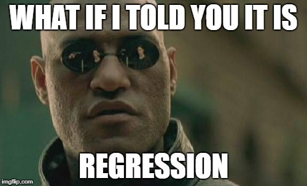
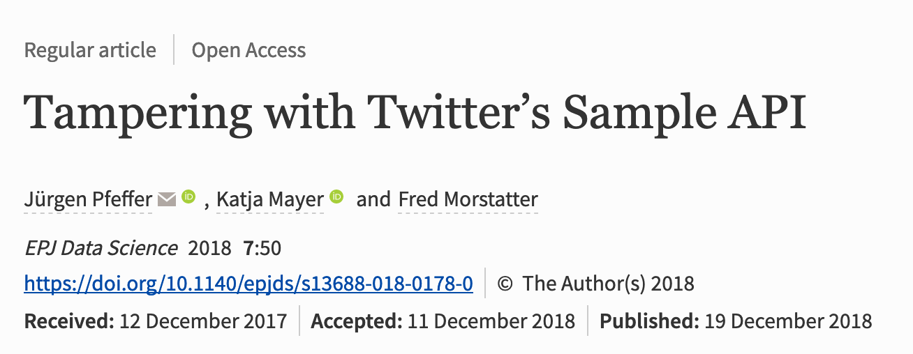
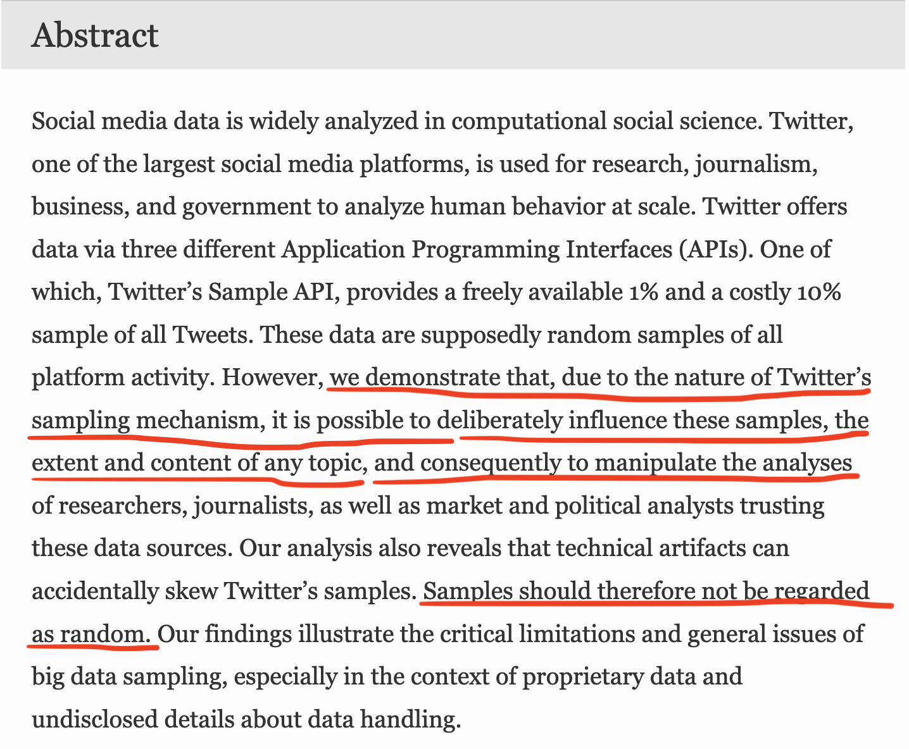
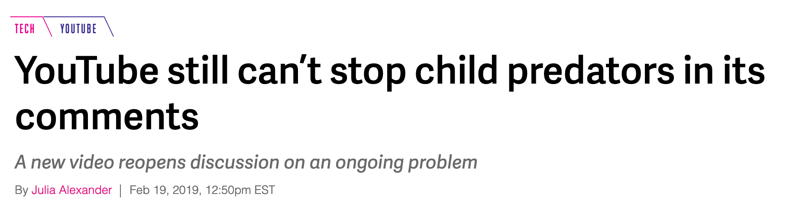
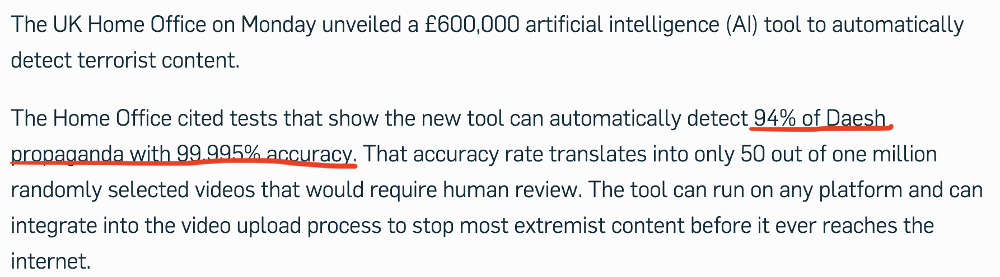
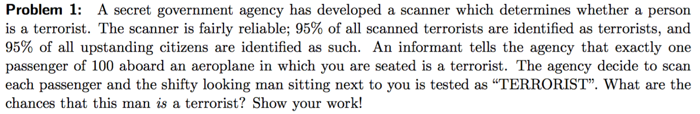
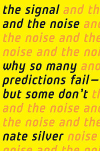

##  {data-background="./img/ucl_artwork/ucl-banner-land-darkblue-rgb.png" data-background-size="70%" data-background-position="top" data-background-opacity="1"}

Advances, Promises and Problems

## Today {.left_aligned}

- problematic trends in data science
- fallacies in data science
- ethical considerations of data science for crime scientists
- an outlook    

+ "R Markdown" talk (Isabelle)


## 

### What do you think? Could there be problems?

## Problematic trends


## Problematic trends



## Problematic trends


## Problematic trends

**Extreme view:** current academic data science is catering hype to compensate the Google envy.

## Problematic trends

Assumptions, assumptions, assumptions, assumptions, assumptions, assumptions, assumptions, assumptions, assumptions, assumptions, assumptions, assumptions, assumptions, assumptions, assumptions, assumptions, assumptions, assumptions, assumptions. Everywhere assumptions.

##



<small>[Pfeffer et al. (2018)](https://epjdatascience.springeropen.com/articles/10.1140/epjds/s13688-018-0178-0)</small>

##



<small>[Pfeffer et al. (2018)](https://epjdatascience.springeropen.com/articles/10.1140/epjds/s13688-018-0178-0)</small>

##

- cognition -> language assumption
- online behaviour -> real behaviour assumption
- methodological flaws: random sampling
- even if: bias population remains!

## Why is this a problem?

### Intermezzo: Reproducibility crisis

##

If we care about data science, we need to do a better job.

##


##

### The technology fallacy

## The technology fallacy


<small>[Img source](https://fullfact.org/europe/border-security-eu/)</small>

## The technology fallacy


<small>[Img source](https://blog.allo.ua/v-es-na-granitse-passazhirov-budet-proveryat-detektor-lzhi-iborderctrl_2018-11-47/)</small>

## The technology fallacy

Popular belief: technology will solve all problems.

- esp. true for data
- "so we just need more data"
- so why not use it for all the difficult problems?

## The technology fallacy

Recent case: 



[Full article](https://www.theverge.com/2019/2/19/18229938/youtube-child-exploitation-recommendation-algorithm-predators), [Exposing YouTube video](https://www.youtube.com/watch?time_continue=4&v=O13G5A5w5P0)

## The technology fallacy

Mmh, that's strange...?

- apparently not a solved problem
- and there's more
    - Facebook
    - Twitter, etc. and content removal
- still: very much relying on humans

## The technology fallacy

Problem:

- this creates unrealistic expectations
- biggest challenge for data science: expectation management


## 

###The naivité fallacy

## The naivité fallacy


## The naivité fallacy



<small>[source](https://nakedsecurity.sophos.com/2018/02/14/new-ai-technology-used-by-uk-government-to-fight-extremist-content/)</small>

## The naivité fallacy


## The naivité fallacy



## The naivité fallacy

|   |  Terrorist | Passenger |
--- | --- | --- | --- | --- |
Terrorist | <span class="fragment" data-fragment-index="5">950</span> | <span class="fragment" data-fragment-index="5">50</span> | <span class="fragment" data-fragment-index="2">1,000</span>
Passenger | <span class="fragment" data-fragment-index="4">4,950</span> | <span class="fragment" data-fragment-index="4">94,050</span> | <span class="fragment" data-fragment-index="3">99,000</span>
|   | <span class="fragment">5,900</span> | <span class="fragment">94,100</span> | <span class="fragment" data-fragment-index="1">100,000</span>

<span class="fragment">`P(terrorist|alarm) = 950/5900 = 16.10%`</span>

## The naivité fallacy

**Put simply:** you can sell anything.

## Here's an idea

```{r eval=F}
ai_terrorism_detection = function(person){
  person_classification = 'no terrorist'
  return(person_classification)
}
```

<p class="fragment">"UCL RESEARCHERS USE AI TO FIGHT TERRORISM!"</p>

<p class="fragment">"AI 99.9999% ACCURATE IN SPOTTING TERRORISTS!"</p>

##


## Data science headlines


## Guide to data science headlines

> "UK government reveals new AI tool for flagging extremist content"

=

<span class="fragment">"UK government ~~reveals new AI tool for flagging extremist content~~ buys snake oil"</span>

## The naivité fallacy

What to do about it:

- avoid the hype
- there is no rocket science here
- 95% is just (a type of) regression
- if it sounds too good to be true, it is

Beware of the hype!

## 

### The category mistake of data science

## Category mistake

[https://www.youtube.com/watch?v=fCLI6kxFFTE](https://www.youtube.com/watch?v=fCLI6kxFFTE)

## Category mistake

- So we are getting there with self-driving cars.
- Hence: we can also address the other challenges.

!!!!

## Category mistake


<small>[Geller, 1999](https://www.nature.com/nature/debates/earthquake/equake_1.html), [538 article](https://fivethirtyeight.com/features/we-still-cant-predict-earthquakes/) </small>


## 

> "I would not be at all surprised if earthquakes are just practically, inherently unpredictable."

[(Ned Field)](https://www.usgs.gov/staff-profiles/ned-field?qt-staff_profile_science_products=0#qt-staff_profile_science_products)


## Category mistake

- Building a sophisticated visual recogntion system != predicting everything
- Static phenomena vs. complex systems


_Human behaviour might be the ultimate frontier in prediction._

##

If you only read one book in 2019...

Read: "The Signal and the noise", Nate Silver




##

### Ethical issues

## Ethics & data science

- data sources
- (machine) learning systems
- reinforcing systems
- responsible practices

## Ethics & data science

Your turn: do you see problems for these aspects?

- data sources
- (machine) learning systems

## Ethics & data science

What about "reinforcing systems"?

## Ethics & data science

Choose 1:

1. FP/FN issue in the hand of practitioners
2. academics' responsibility


##

### An outlook

What would an ideal Data Science look like?

## Be specific...

Academic data science

vs

"Industry" data science

##

**Extreme view:** 

current academic data science is catering hype to compensate the Google envy.

##


## Academic data science

| What it is doing | What it should be doing |
| ---------------- | ------------------------|
| creating "cool" studies | testing assumptions |
| pumping out non-reproducible papers | investing in fundamental data science research |
| hiring people to do cool things with our data | starting with the problem |
| getting on the data science train | focus on methods of data science |

## Outlook

- we need *boring* studies!
    - longitudinal studies
    - assumption checks
    - replications
- we need to accept that Google & Co. are a different league in applying things
- we need to focus on the "ACADEMIC" part
- we need unis as control mechanism, not as a player

## For the future

Assumptions, assumptions, , assumptions, assumptions, assumptions, assumptions, assumptions, assumptions, assumptions, assumptions, assumptions, assumptions, assumptions, assumptions, assumptions, assumptions, assumptions, assumptions, assumptions, assumptions, assumptions, assumptions, assumptions, assumptions, assumptions, assumptions, assumptions, assumptions, assumptions, assumptions, assumptions. Everywhere assumptions.

_Test them!_


## This week

FEEDBACK submission + revision + your project

## Next week

- Lecture : The Applied Data Science pipeline
- Tutorial: full pipeline + your project


## END