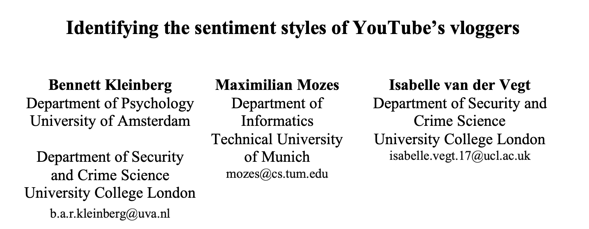
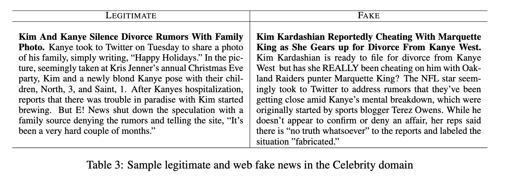
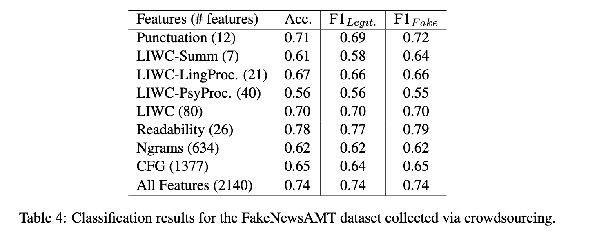
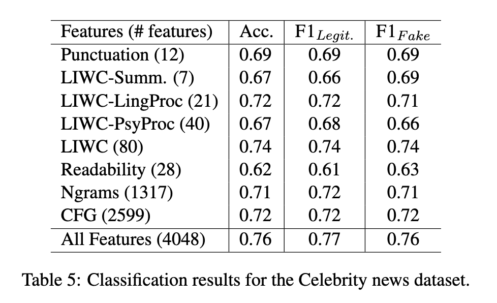
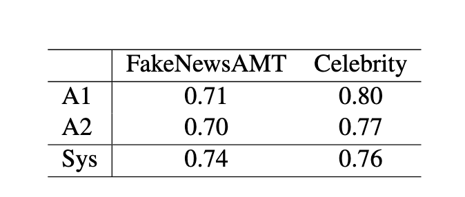

##  {data-background="./img/ucl_artwork/ucl-banner-land-darkblue-rgb.png" data-background-size="70%" data-background-position="top" data-background-opacity="1"}

Recap + peer-feedback

## Today

- 2 case studies
- module recap
- your feedback
- peer-feedback

## 

### Case study 1 [(URL)](http://aclweb.org/anthology/D18-1394)

##

## Sentiment styles: RQ

Are there patterns in sentiment usage in popular YouTube vlogs?

## Needed

- vlog data
- sentiment "trajectories"
- cluster analysis

## Data pipeline

- retrieved list of most popular vloggers
- excluded those that were no real vloggers and non-English speaking
- scraped transcripts for each vlog
    - 27,333 transcripts
    - 40m tokens
    - 24b views

## Analysis

- unsupervised learning
- k-means method
- assigned each vlog to its cluster

## Findings

- 7 distinct sentiment styles
- preferance was moderated by gender

## Findings

| Cluster            	| Family 	| Female 	| Male   	|
|--------------------	|--------	|--------	|--------	|
| Downhill from here 	| 2.23   	| 1.26   	| -2.88* 	|
| Mood swings        	| -2.31  	| 1.96   	| 1.25   	|
| Rags to riches     	| 2.13   	| -1.95  	| -1.08  	|
| Riches to rags     	| -2.05  	| 4.88*  	| -0.56  	|
| Bump in the road   	| 1.69   	| -1.12  	| -1.08  	|
| End on a high note 	| -5.16* 	| -6.03* 	| 8.32*  	|
| Twin peaks         	| 3.83*  	| 2.25   	| -4.99* 	|

## Findings

- 7 distinct sentiment styles
- preferance was moderated by gender
- no effect on view count
- no effect on vlog length

##

### Case study 2[(URL)](http://aclweb.org/anthology/C18-1287)

##

## Fake news paper: RQ

Can we detect fake news based on linguistic features in the news article?

## Needed

- fake and real news
- different domains of news
- predictive analysis

## Data pipeline

- sourcing "real" news from mainstream news sites
- crowdsourcing approach for fake news
- news domain (sports, business, politics, technology, entertainment, education)

## Data pipeline

## Data pipeline

## Data pipeline

- sourcing "real" news from mainstream news sites
- crowdsourcing approach for fake news
- news domain (sports, business, politics, technology, entertainment, education)
- celebrity domain
    - Entertainment Weekly, People Magazine,RadarOnline
    - checked with GossipCop.com and other online sources

## Analysis

- extracted linguistic features
    - ngrams, punctuation, LIWC, readability, syntax
- supervised learning
    - SVM classifier
    - 5-fold CV
    - 50% baseline

## Findings

## Findings

## Findings

<small>Table 9: Performance of two annotators (A1, A2) and the developed automatic system (Sys) on the fakenews datasets</small>

##

##

### Module recap

## You've learned a lot:

- data generation/collection
- text analysis
- machine learning

## Data generation/collection

- APIs
- custom-made webscraping

## Text analysis

- sentiment
- ngrams
- LIWC
- TFIDF

## Machine learning

- supervised learning
- unsupervised learning
- cross-validation
- performance metrics

##

##

### Your feedback?

##

### Peer-feedback session

## Next week

CLASS TEST

- Monday, 18 March 2019
- 1-3pm
- 60 min
- 10 questions (5 MC, 5 open)

## END