##  {data-background="./img/ucl_artwork/ucl-banner-land-darkblue-rgb.png" data-background-size="70%" data-background-position="top" data-background-opacity="1"}

Horizon scanning and Data Science

## 

### Before we start

##

How tall am I (in cm)?

## Today

- Data collection
- Information extraction
- Crowdsourcing and "wisdom of the crowd"
- Hype and hope

## What's the point?

1. Problem of scale
2. Problem of weak signals


## Earthquakes and piranhas


<small>[Geller, 1999](https://www.nature.com/nature/debates/earthquake/equake_1.html), [538 article](https://fivethirtyeight.com/features/we-still-cant-predict-earthquakes/) </small>

##


<small>see [Andrew Gelman's post](https://statmodeling.stat.columbia.edu/2017/12/15/piranha-problem-social-psychology-behavioral-economics-button-pushing-model-science-eats/)</small>


##

> "I would not be at all surprised if earthquakes are just practically, inherently unpredictable."

[(Ned Field)](https://www.usgs.gov/staff-profiles/ned-field?qt-staff_profile_science_products=0#qt-staff_profile_science_products)

##

### Horizon scanning and data science

##

~~It all starts with the data.~~

It all starts with a problem.


## Problem for today

Where are the weak signals? _(data)_

How can we deal with the information overload? _(information extraction)_

##

### Data collection

## Where are the weak signals?

- newspaper coverage
- patents

## Newspaper coverage

Idea: **weak signals in newspaper coverage**

## Newspaper coverage

Many newspapers have an Application Programming Interface (API):

- offers structured access to the data
- requires access credentials
- pro: stable and structures
- con: under platforms control

<small>more on APIs and webscraping --> [here](https://raw.githack.com/ben-aaron188/ucl_aca_20182019/master/slides/aca_20182019_lecture2_apis.html)</small>

## Newspaper coverage

Example: Guardian coverage on drill music

```{r eval=F}
get_guardian("%22drill+music%22",
                        from.date="2018-02-01",
                        to.date="2018-03-01",
                        api.key="YOUR_ACCESS_KEY")
```

## Drill music in the Guardian

```{r echo=F}
load("./drill_music_guardian.RData")
```

Variables:

- title
- date
- word count
- article
- ...

## Example

```{r echo=F}
as.character(guardian_drill_music$headline[3])
```

```{r echo=F}
as.character(guardian_drill_music$webPublicationDate[3])
```

##

```{r echo=F}
as.character(guardian_drill_music$body[5])
```

## More newspaper sources

- Associated Press
- BBC
- Bloomberg
- Reuters
- (list of APIs [here](https://en.wikipedia.org/wiki/List_of_news_media_APIs))

## Why newspapers?

- might offer initial hints (e.g. knife crime & drill music association)
- offer rich accounts of events
- but: curated!
- possible for future: comment sections

##

## Patents

Idea: **weak signals in patent filings**

- patents as early indicators of trends
- by definition "new"

## Patents

Case study: 3-D printing

CPC classification of patents [espace.net](https://worldwide.espacenet.com/classification#!/CPC=B29C64/00)

##

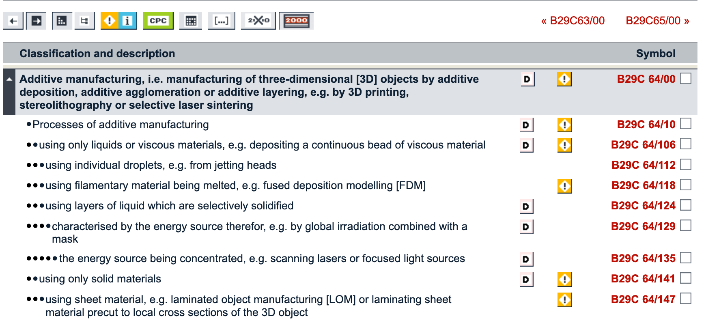

## Accessing patent data

- Using PatentsView [API](http://www.patentsview.org/api/query-language.html)
    - sends a data request in the browser
    - e.g. "http://www.patentsview.org/api/patents/query?q={"patent_number":"7861317"}"
- Use [API wrappers](https://ropensci.org/blog/2017/09/19/patentsview/)
    - `patentsview` R package
    - also: [Google Patents Scraper](https://github.com/amnonkhen/google-patents-scraper)
- Google Patents [Datasets](https://console.cloud.google.com/marketplace/partners/patents-public-data)

## Running an API request

Through the browser:

```{r eval=F}
http://www.patentsview.org/api/patents/query?q={
  "_and":[{
    "_gte":{
      "patent_date":"2009-01-01"
    }
  },{
      "cpc_subgroup_id":"B29C64/00"}]}
```

## 


## Running an API request

Through an API wrapper:

```{r echo=F}
load("./patent_data_3dprint.RData")
```


```{r eval=F}
pv_3d_print = search_pv(query = query
                        , fields = fields
                        , all_pages = TRUE)
```

##


## Retrieved patents data

- patent number
- patent year
- patent abstract
- assignee info
    - country, long-lat, city
    - number of inventors, number of patents
- CFC meta data (group, subgroup)

## Example

```{r}
pv_3d_print$data$patents$patent_abstract[1]
```

## Patents

Case study: Weapons

1. Seach CPC classification
2. Define search query
3. Retrieve data

## 1. Seach CPC classification

[https://worldwide.espacenet.com/...](https://worldwide.espacenet.com/classification#!/CPC=/)

## 2. Define search query

- general (overarching category): "F41"
- start in 2014

```{r eval=F}
http://www.patentsview.org/api/patents/query?q={
  "_and":[{
    "_gte":{
      "patent_date":"2014-01-01"
    }
  },{
      "cpc_subgroup_id":"F41"}]}
```

## 3. Retrieve data

```{r echo=F}
load("./patent_data_weapons.RData")
```


```{r eval=F}
pv_weapons = search_pv(query = query
                        , fields = fields
                        , all_pages = TRUE)
```


##

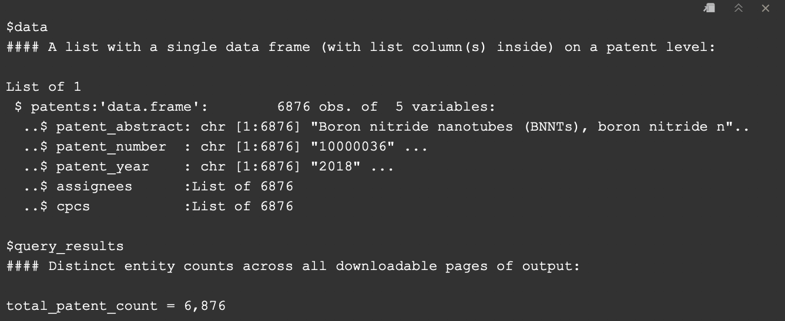


## Example

```{r echo=F}
pv_weapons$data$patents$patent_abstract[52]
```


## Resources

- [Google NGram Viewer](https://books.google.com/ngrams)
- APIs
- [Google Trends](https://trends.google.com/trends/explore?date=all&q=3d%20gun)
- [Google Toolbox](https://toolbox.google.com/datasetsearch)
- [data.world](https://data.world/)
- [Kaggle](https://www.kaggle.com/)

## Google Trends example

[3D Guns + Cody Wilson](https://trends.google.com/trends/explore?q=3d%20guns,cody%20wilson)

## Google Toolbox example

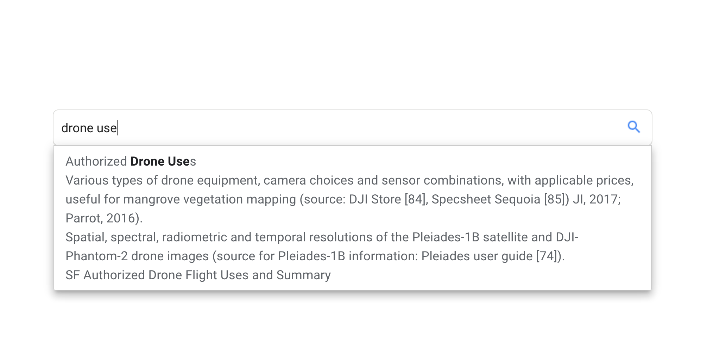

##

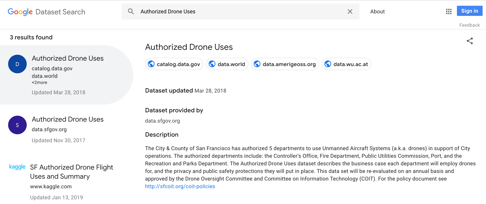

##

##

### Information extraction

## How can we deal with the information overload?

- frequency analysis
- information extraction (NLP)

## Intermezzo

The language challenge?


## Possible approaches

- token occurrence
- sentiment
- Keywords-in-context
- Co-occurrences

## Token occurrence

Eyeballing but uninformative.


## Sentiment analysis: aim

- measure positive/negative tone
- "emotionality" of a text
- builds on the "language -> behaviour" and "cognition -> language" nexus

## Basics of sentiment analysis

1. tokenise text
2. construct a lexicon of sentiment words
3. judge the sentiment words
4. match tokens with sentiment lexicon

## Sentiment analysis

- shifting units of analysis
- single texts, sentences, dynamic approaches
- current idea: sentiment is dynamic within text

## 

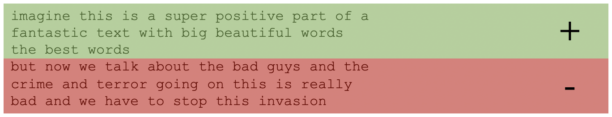

## Sentiment trajectories


(e.g. our [EMNLP 2018 paper](http://aclweb.org/anthology/D18-1394))


## Sentiment for single articles

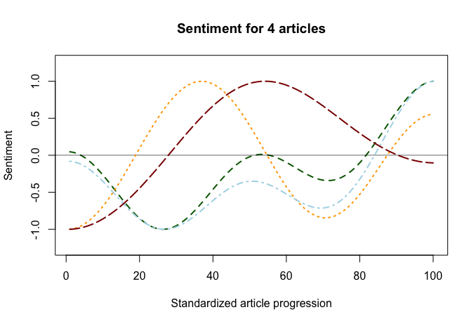

## Sentiment trajectories for all articles

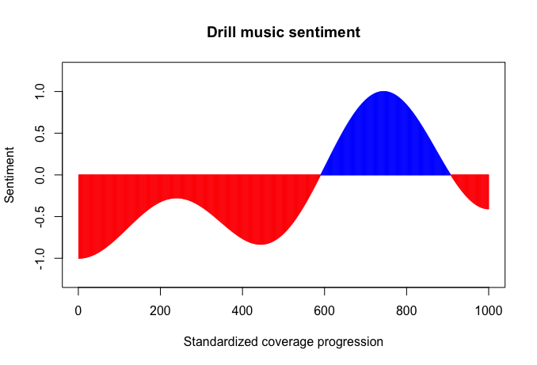

## Keywords in context

```{r echo=F}
load('guardian_corpus.RData')
kw_i_c = quanteda::kwic(x = guardian_corpus, pattern = c('gang'))
knitr::kable(kw_i_c[1:8,c(1,4,5,6)])
```

## Keywords in context

```{r echo=F}
kw_i_c = quanteda::kwic(x = guardian_corpus, pattern = c('drill'))
knitr::kable(kw_i_c[11:15,c(1,4,5,6)])
```

## Co-occurrences

```{r}
load('guardian_fcm_g.RData')
knitr::kable(fcm_g[1:6, 1:6])
```


## Text network

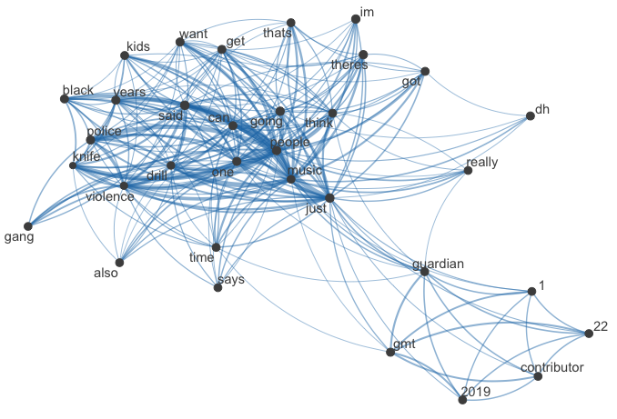

## Case study patents

- use patents data to identify trends
- patents per category over time
- example: weapons (pistols vs armour)

## Case study patents

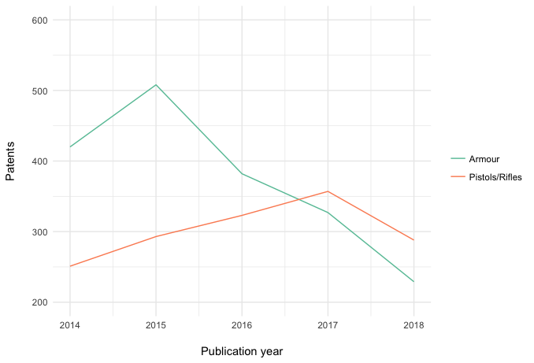

## Case study TechCrunch

- all headings of [TechCrunch](https://techcrunch.com/?guccounter=1&guce_referrer_us=aHR0cHM6Ly93d3cuZ29vZ2xlLmNvbS8&guce_referrer_cs=Gm7V4neqDrhXGuZrXfY4yQ) and [VentureBeat](https://venturebeat.com/) for 2017
- ~23k headings
- e.g. "MyTomorrows raises further 10M to help access drugs in development"

Might help identify "tech trends"

## Case study TechCrunch

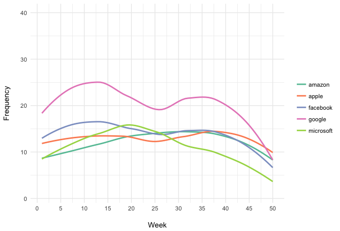

## Case study TechCrunch

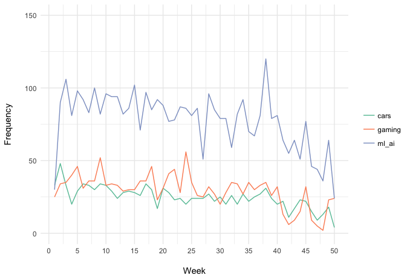

##

### Non text-based data

## "Traditional" data

- directly quantified
- essentially directly usable
- especially: price data, trading data


##

### Crowdsourcing

## Crowd intelligence

Maybe collectively, we are better than individually...

##

```{r eval=F}
your_estimates_cm = ...
```

What does this tell you?

##


<small>[The parable of the ox](https://www.ft.com/content/bfb7e6b8-d57b-11e1-af40-00144feabdc0), FT, 2012</small>


## Boundaries of crowd intelligence

- needs diversity
- needs volume
- needs a precise answer
- prone to [social influence](http://www.bbc.com/future/story/20140708-when-crowd-wisdom-goes-wrong)


##

### Hype and hope

## Pitfalls and hype

- long vs. wide data
- unknown unknowns of trend places

## Pitfalls and hype

Evaluation of horizon scanning

## Pitfalls and hype

Assumptions, assumptions, assumptions

## Pitfalls and hype

Beware of category mistakes

## The hope

- Until now: impossible task
- Information overload for analysts
- Data Science (esp. NLP) can address this
- Machine learning (potentially) promising
- Human-in-the-loop might help (note: ASSUMPTION)

Example: gang-violence

## But

"Just gather more data!"

More data = better solutions

## Enter: the spurious correlation

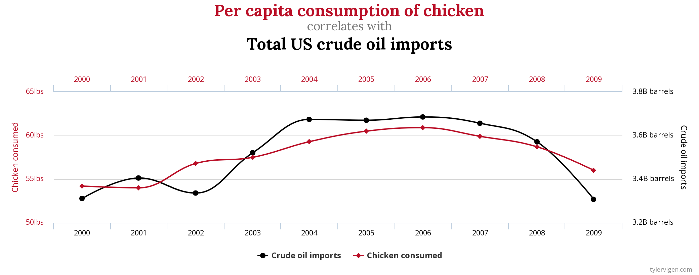

<small>[http://www.tylervigen.com/spurious-correlations](http://www.tylervigen.com/spurious-correlations)</small>

##


##

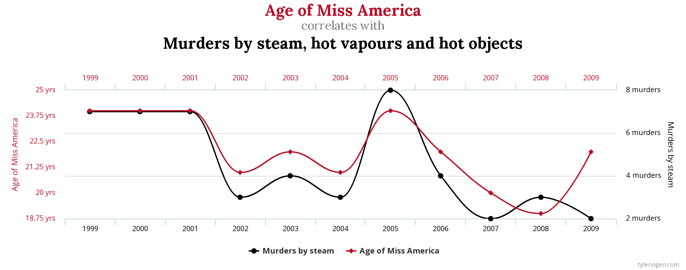

## Ongoing work on trend detection

- cryptocurrency fraud detection (coin-level)
- shifts in abusive language (individual-level)

## Crypto fraud detection

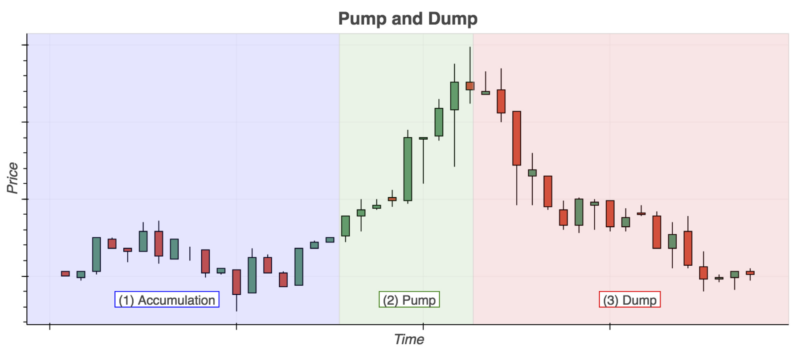

<small>[Kamps & Kleinberg, 2018](https://link.springer.com/article/10.1186/s40163-018-0093-5)</small>

## Abusive language

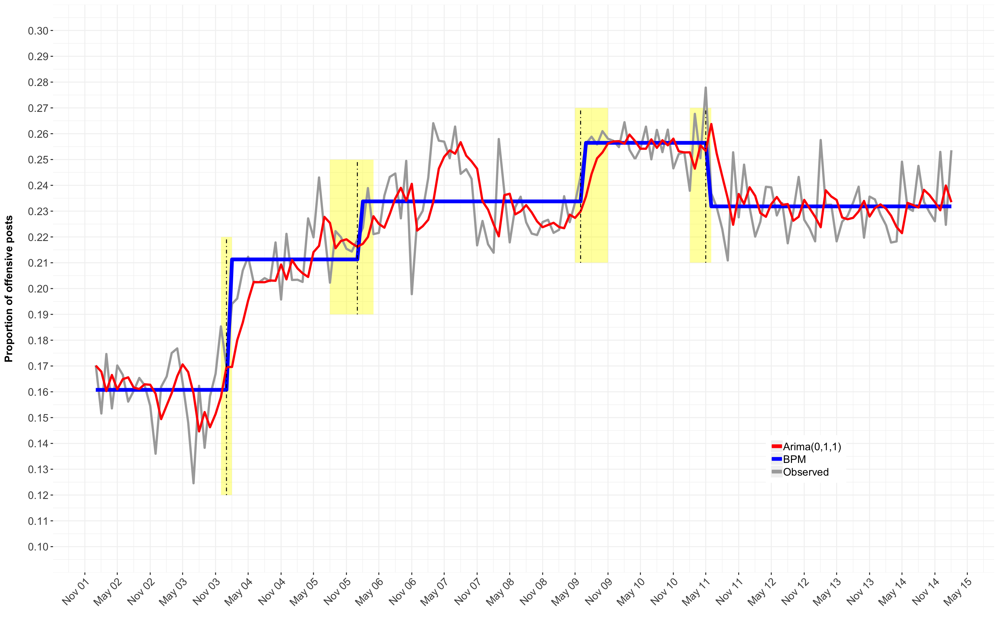

<small>Kleinberg, van der Vegt, Gill (forthcoming)</small>

## Abusive language

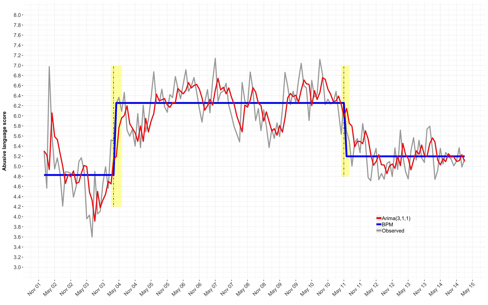


## Recap

- Some useful resources
- Information extraction problem
- Pitfalls of data science
- Promise in NLP

<small class="fragment"> Advice of the year: Learn how to code.</small>

## Note

Full module on Data Science

[https://github.com/ben-aaron188/ucl_aca_20182019](https://github.com/ben-aaron188/ucl_aca_20182019)

APIs/Webscraping, Text mining, Machine learning

##

> "I would not be at all surprised if earthquakes are just practically, inherently unpredictable.... **You never know; some silver bullet could come along and prove useful.**"

[(Ned Field)](https://www.usgs.gov/staff-profiles/ned-field?qt-staff_profile_science_products=0#qt-staff_profile_science_products)


##

If you only read one book in 2019...

Read: "The Signal and the noise", Nate Silver


##

### END.